# Mini Agent · 详细设计文档

> **依据**：仓库当前源码与 `mini-agent-app/src/main/resources/application.yml`（默认 profile）。  
> **日期**：2026-09-21。  
> **原则**：只写已经实现的行为。未接线、已删除、配置存在但主路径不用的能力，一律放在「第 13 章 已知局限」，禁止当成已具备能力去实现。  
> **本文是唯一详细设计文档。** 先总体结构（第 3～4 章），再分模块设计（第 5 章）。

---

## 1. 文档说明

| 项目 | 内容 |
|------|------|
| **文档名称** | Mini Agent 详细设计（可按模块复现） |
| **版本号** | V1.3 |
| **状态** | 按代码反构，非愿景稿 |
| **代码根** | Maven 聚合工程 `mini-agent-springboot` |
| **Java / Spring / LC4j** | Java 21 / Spring Boot 3.4.5 / LangChain4j 1.15.0（根 `pom.xml`） |

**给初级工程师的读法**

1. 第 2～3 章：范围、分层、Maven、运行时七块怎么串、契约、重规划落点。
2. 第 4 章：一轮 HTTP 对话与权限。
3. 第 5 章：分模块设计（拆解 / 工具 / 记忆 / 上下文 / 规划 / 执行 / 闭环 + 认证、前端、轨迹）。
4. 第 6 章起：数据、接口、部署、局限。第 14 章落地顺序。

---

## 2. 项目范围与功能点

### 2.1 系统是什么

Mini Agent 是 **单进程 Spring Boot Web 应用**：浏览器打开 `http://127.0.0.1:8080/`，登录后对话。服务端用 OpenAI 兼容 Chat Completions（默认 MiMo v2.5）驱动 **ReAct 循环**（`AgentLoop`）或 **任务图规划循环**（`PlanningLoop`），工具走统一入口 `ToolPipeline`，过程通过 **SSE** 推到前端。

它 **不是**：独立训练平台、多租户 SaaS 水平扩展集群（默认 `agent.replica.mode=local`）、也不是已删除的「意图分类」子系统。

### 2.2 用户角色（代码里真实存在）

| 角色 | 入口 | 能做什么 |
|------|------|----------|
| 未登录用户 | `GET /` → `login.html` | 登录；若 `agent.auth.registration-enabled=true` 可注册 |
| 登录用户 | `chat.html` | 对话、上传、选模型、权限模式、待办确认、看自己的会话/轨迹 |
| `SYSTEM_ADMIN` | `/api/admin/*` | 租户/用户/审计 **接口已写**；HTTP 层目前只要求已登录，见第 13 章 |

### 2.3 功能点清单（已实现）

| 编号 | 功能点 | 落点 |
|------|--------|------|
| F01 | 账号登录/注册/退出，JWT Cookie + Redis 滑动 TTL | `JwtSessionService`、`/api/login` |
| F02 | 对话页：侧栏历史、设置（模型/主题/退出）、SSE 流式思考与正文 | `templates/chat.html`、`POST /chat/stream` |
| F03 | 任务信号：从用户原文用正则抽事实，不做意图枚举 | `TaskSignalMatcher`、`agent.task-signals.rules` |
| F04 | 上下文组装：LIGHT / CONTINUE / ACTION 三套加载策略 | `ContextLoadPolicy`、`ContextLoader` |
| F05 | 直跑 Agent：ReAct，上限 `agent.execution.max-iterations`（默认 **90**） | `AgentLoop` |
| F06 | 规划 Agent：图为 SSOT，Todo 只是投影；节点内再跑 AgentLoop | `PlanningLoop`、`PlannerStateStore` |
| F07 | 子代理：`delegate_task`，内层上限 **25** | `DelegateTaskTool`、`subagent-max-iterations` |
| F08 | 统一工具管道：权限、确认、超时、死循环 | `ToolPipeline` |
| F09 | 内置工具：文件/命令/浏览器/搜索/生图/ComfyUI/技能/文档等 | `BuiltinTools` 及各 `*Tool` |
| F10 | MCP：可选，工具名 `mcp__{serverId}__{tool}` | `McpToolBridge`，默认 `agent.mcp.enabled=false` |
| F11 | 权限模式：default / plan / accept_edits / ask | `PermissionMode`、`PermissionPolicy` |
| F12 | 待办 `todo` 工具 + 前端任务条/计划列表 | `TodoTool`、`TaskTodoStore`、SSE `todo` |
| F13 | 记忆：blob + 结构化 MemoryManager；巩固异步 | `MemoryService`、`MemoryController` |
| F14 | 会话历史窗口 `agent.chat-memory.max-messages` 默认 **64** | `ChatMemoryConfig` |
| F15 | 轨迹落库 + `/trace` 页 + SSE `trace` | `TraceRecorder`、`agent_trace_steps` |
| F16 | 上传文件/图片/音视频（音视频源文件约 35MB） | `/api/upload`、`agent.multimodal.*` |
| F17 | 租户日 token 配额、并发任务上限 | `DbTenantTokenQuota`、`max-tasks-per-user=2` |
| F18 | 健康检查 `/health`（actuator）与 `/api/planner/health` | `HealthController` |

### 2.4 系统上下文

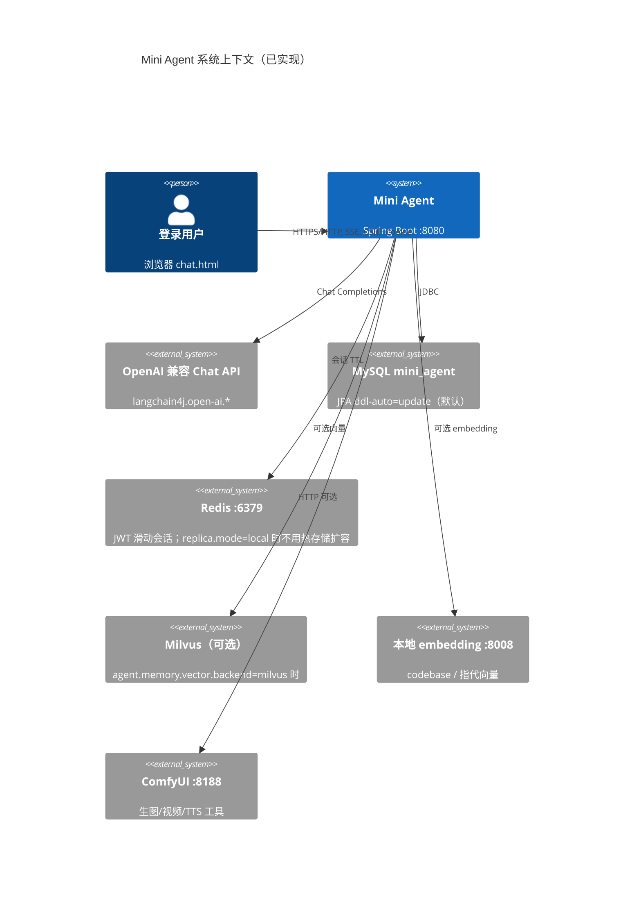

### 2.5 性能与预算（来自配置，不是 SLA 承诺）

| 指标 | 配置键 | 默认值 | 含义 |
|------|--------|--------|------|
| HTTP/SSE 超时 | `server.tomcat.connection-timeout` / `agent.sse.timeout-ms` | 1800000 ms（30 分钟） | 长任务不在 30s 内结束 |
| 直跑循环上限 | `agent.execution.max-iterations` | **90** | `AgentLoop` 封顶 |
| 子代理循环上限 | `agent.execution.subagent-max-iterations` | **25** | `delegate_task` 内层 |
| 规划节点一段 ReAct | `agent.planner.proposal-max-iterations` | **8** | 浏览器步骤可升到 16 |
| 同节点续跑段数 | `agent.planner.proposal-max-chunks` | **6** | 与 8 相乘为节点上限，不是第三个内核 |
| 规划外层轮次 | `agent.planner.max-outer-rounds` | **24** | 图调度圈数 |
| 单次工作窗口 | `agent.context.max-tokens` | 512000（估算 token） | 75% 触发压缩 |
| ChatMemory 条数 | `agent.chat-memory.max-messages` | **64** | 滑动窗口条数，非 token |
| 工具调用上限 | `agent.execution.max-tool-calls` | 120 | `ExecutionControl` |
| 本轮估算 token 预算 | `agent.execution.max-estimated-tokens` | 2000000 | 超限停跑 |
| 运行墙钟 | `agent.execution.deadline-ms` | 1800000 | 同上 |
| 每用户并发任务 | `agent.concurrency.max-tasks-per-user` | 2 | 超限拒绝新跑 |
| 接口限流 | `agent.rate-limit.per-minute` | 60（dev） | 按用户或 IP |
| 出图重编译 | `agent.planner.max-replan-retries` | **2**（Java 字段，yml 未写则用此值） | `PlanValidator` 拒绝后 `compileWithCorrection` |
| 运行时改图 | `agent.planner.max-rewrite-graph` | **2** | `REWRITE_GRAPH` LLM 重编未完成子图 |
| 改目标 | `agent.planner.max-revise-goal` | **1** | `REVISE_GOAL` |
| 规划总恢复 | `agent.planner.max-recoveries` | **3** | 达限则节点 CANCELLED |

这些是 **引擎预算**，仓库里没有单独的「QPS 99.9%」监控合同。

---

## 3. 总体架构

### 3.1 架构模式（已选定）

**模块化单体（Maven 多模块 + 一个可运行 app）**，不是微服务。理由：同一进程内循环、工具、SSE 共享会话；拆服务会把 `sessionId` 状态打散。

编排是 **双内核**：

| 内核 | 类 | 何时进 |
|------|-----|--------|
| ReAct | `AgentLoop` | `PlanningLoop.shouldHandle` 为 false |
| 任务图 | `PlanningLoop` | `agent.planner.enabled=true` 且命中复杂/图信号，或未完成图按 `PlannerResumePolicy` 续跑 |

`delegate_task` **不是第三套顶层路由**，是工具，内部再 new 一轮 `AgentLoop`（上限 25）。

### 3.2 分层

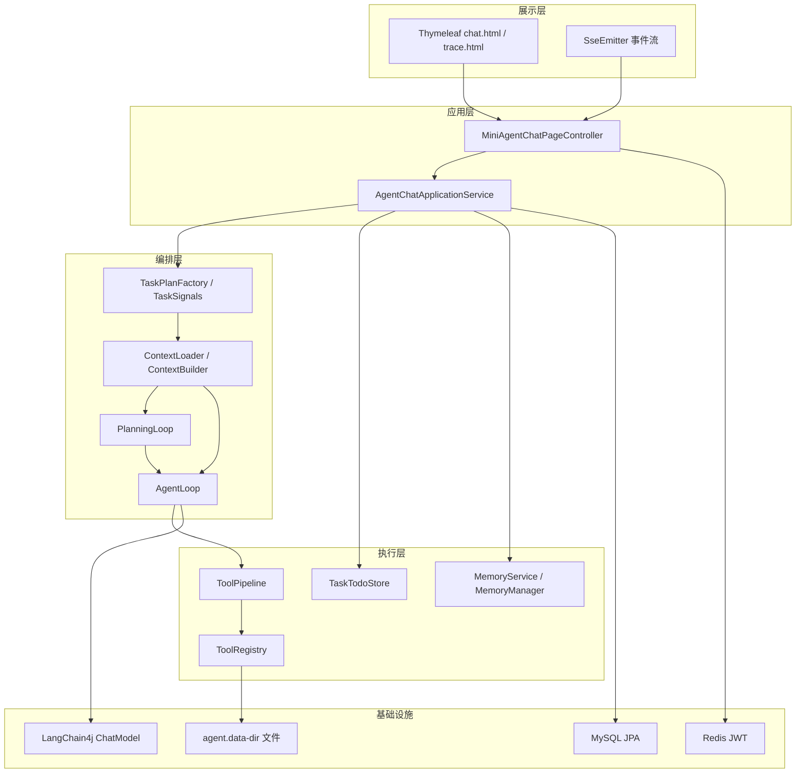

| 层次 | 技术 | 职责 |
|------|------|------|
| 展示 | Thymeleaf + 内联 JS/CSS | 对话、设置、任务条、流式渲染 |
| 应用 | Spring MVC | 鉴权、会话、流式桥接、上传 |
| 编排 | loop + planner | 信号 → 上下文 → 选内核 → 停机策略 |
| 执行 | tools | 唯一工具入口、权限、副作用 |
| 基础 | MySQL / Redis / 本地盘 / 外部 LLM | 持久化与模型 |

层间协议：浏览器 ↔ 应用为 HTTP + SSE；编排 ↔ LLM 为 LangChain4j；工具为进程内方法调用。

### 3.3 Maven 模块依赖（必须无环）

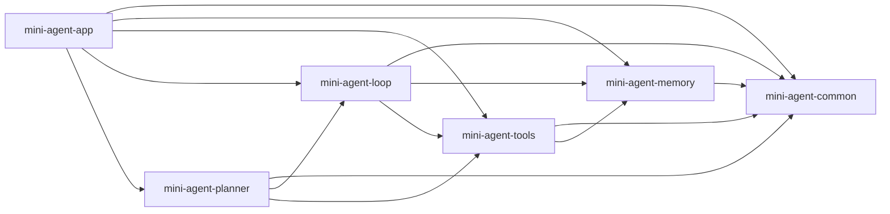

| 模块 | 职责（一句话） |
|------|----------------|
| `mini-agent-common` | `ApiResponse`、`ErrorCode`、`MessageConstants`、共享 embedding/Milvus 客户端 |
| `mini-agent-memory` | `MemoryStore` / `MemoryService` 接口、数据目录 `AgentDataPaths` |
| `mini-agent-tools` | `ToolRegistry`、内置工具、MCP、浏览器、ComfyUI |
| `mini-agent-loop` | `AgentLoop`、上下文、权限、Todo、轨迹、`delegate_task` |
| `mini-agent-planner` | `PlanningLoop`、图编译/调度/评估 |
| `mini-agent-app` | 可运行 JAR：Controller、Security、Thymeleaf、把上面全部装配成 Bean |

**落地顺序**：common → memory → tools → loop → planner → app。不要先写 planner 再倒着补 loop。


### 3.4 两套「模块」不要混

| 视角 | 是什么 | 用来干什么 |
|------|--------|------------|
| 编译期 | Maven：common → memory → tools → loop → planner → app | 依赖必须无环；落地顺序按这个 |
| 运行时 | 拆解 / 工具 / 记忆 / 上下文 / 规划 / 执行 / 闭环 | 一轮对话里真实调用关系 |

Maven 的 `mini-agent-loop` **同时装了**拆解、上下文、执行、部分闭环，不是「一个 jar 等于一个运行时模块」。实现时按运行时边界拆类，不要按 jar 名各写一套。

### 3.5 运行时总图（一轮用户消息）

这是 **一轮原文怎么穿过七块**。不是规划器内部每一圈，也不是 Maven 图。

**重规划不是第 8 块。** 它在规划模块内部：出图验收失败会改编译；节点失败按 `RecoveryEngine` 分类，只有改图/改目标才 LLM 重编未完成子图。直跑没有图，因此没有重规划。没有「重新规划」按钮。

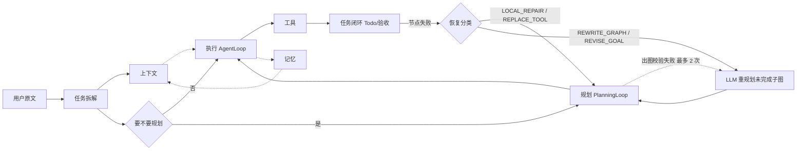

### 3.6 模块间契约（钉死再写代码）

| 从 → 到 | 契约 |
|---------|------|
| 拆解 → 上下文 | `TaskPlan.signals` 决定 LIGHT / CONTINUE / ACTION |
| 拆解 → 规划 | `requiresStructuredPlan` 或 `hasGraphSignal` 或未完成图续跑 |
| 规划 → 执行 | `NodeExecutor` + 围栏；节点 8/16 × 6，**不是 90** |
| 执行 → 工具 | 只 `ToolPipeline.invoke(ToolRequest)` |
| 工具 → 闭环 | `ToolResult` / 证据给 `StepEvaluator` |
| 规划 → 闭环 | `TodoStateProjector` **覆盖写出**，禁止 Todo 写回图 |
| 记忆 → 上下文 | 只 `retrieveForPrompt(policy)` |
| 上下文 → 执行 | `LoadedContext.systemPrompt` + `history` |

---

## 4. 核心业务流

### 4.1 一次对话（主路径）

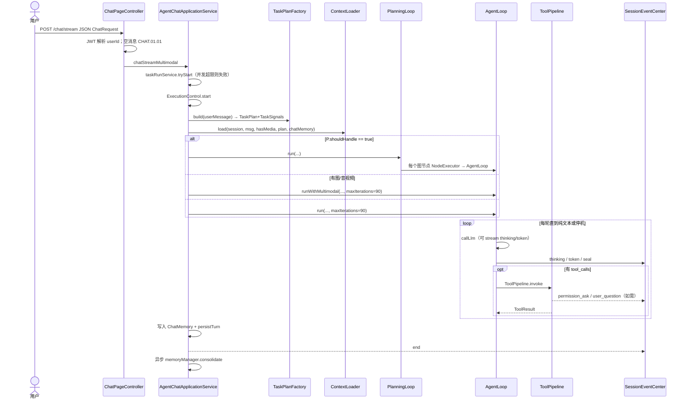

**停机条件（AgentLoop，源码常量）**：纯文本终答；`MAX_ITERATIONS`；`DUP_TOOLS`（同失败工具 ≥3）；`OUTCOME_UNKNOWN`；`CANCELLED`；`DEADLINE_EXCEEDED`；`PERM_ASK`；`USER_QUESTION`；资源/配额耗尽等。

### 4.2 任务信号 → 上下文策略 → 内核

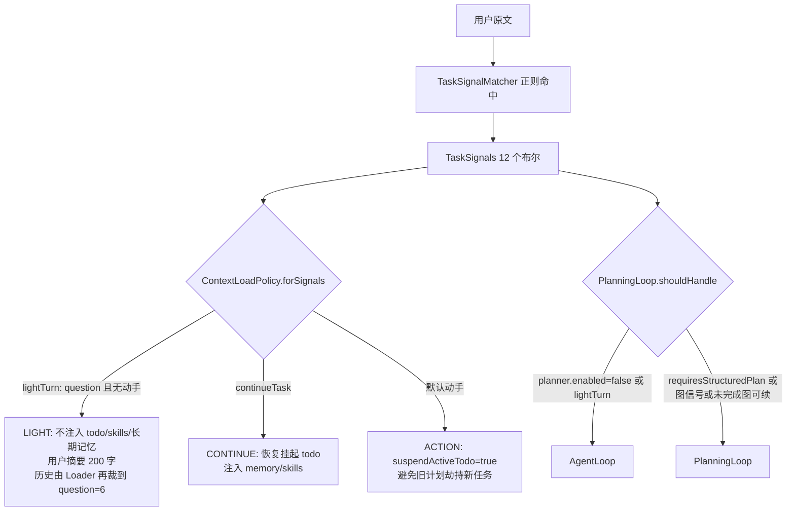

`TaskSignals.lightTurn()` = `question && !actionBearing()`。`actionBearing` **不含** `readsFile`（避免「分析这句话」被当成要动文件系统）。

`needsStructuredPlan`（`TaskPlanFactory`）为真当：`complex` 或 `diagram` 或（`needsWeb && needsFiles`）或（`needsFiles && !simpleFile`）或（`imageIntoDoc && force-full-on-image-into-doc`）。配置键 `agent.task-signals.rules.force-full-on-image-into-doc` 默认 **true**。

### 4.3 工具调用（所有工具必须走这里）

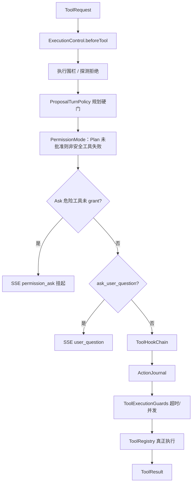

实现新工具：写 `@Component`，在 `@PostConstruct` 里 `registry.register(name, spec, handler)`。**禁止**在 `AgentLoop` 里 `if (name.equals(...))` 旁路。

### 4.4 权限模式状态

```mermaid
stateDiagram-v2
    [*] --> DEFAULT: ChatRequest.permissionMode 缺省
    DEFAULT --> PLAN: PUT /api/permission-mode mode=plan
    PLAN --> DEFAULT: approve_plan 后继续执行
    DEFAULT --> ASK: mode=ask
    ASK --> DEFAULT: grant_ask 后该工具本会话放行
    DEFAULT --> ACCEPT_EDITS: mode=accept_edits
    note right of PLAN
        未批准：specs 仅 PLAN_SAFE_TOOLS
        写/exec/生图不可用
    end note
    note right of ASK
        危险工具仍出现在 specs
        执行时拦截并推 permission_ask
    end note
    note right of ACCEPT_EDITS
        needsSessionGrant 恒 false
        待办确认可跳过
    end note
```

`agent.tools.exec-enabled=true`（默认 profile）时 `exec_command` 免批；`http_post` 在 default 仍要 grant。生产 profile 把 `exec-enabled` 设为 false。

---

## 5. 功能模块详细设计

先读第 3 章总体结构，再按本节分模块实现。内核模块骨架：边界 → 类型 → 流程 → 配置 → 清单 → 禁止。

| 节 | 模块 |
|----|------|
| 5.1 | 认证与会话 |
| 5.2 | 对话应用服务 |
| 5.3 | 任务拆解 |
| 5.4 | 工具 |
| 5.5 | 记忆 |
| 5.6 | 上下文 |
| 5.7 | 规划（含重规划） |
| 5.8 | 执行 |
| 5.9 | 任务闭环 |
| 5.10 | 前端对话页 |
| 5.11 | 轨迹 |

### 5.1 认证与会话

**实现逻辑**

1. `POST /api/login`：校验用户 → `JwtSessionService.issueToken` 写 Cookie `ma_token`，Redis 键 `session:jwt:{jti}`，TTL = `agent.auth.jwt-ttl-seconds`（默认 **1800**）。JWT `exp` 上限 `jwt-exp-seconds`（默认 7 天），真正闲置超时靠 Redis TTL 刷新。
2. 过滤器解析：`Authorization: Bearer`、Cookie、或 query `access_token`（给 EventSource）。
3. 每次鉴权刷新 Redis TTL（滑动窗口）。
4. `GET /api/logout`：删 Redis + 清 Cookie，重定向 `/`。
5. CSRF：Cookie `XSRF-TOKEN`，写操作要头 `X-XSRF-TOKEN`。

**配置（dev 默认）**：`registration-enabled=true`，`password-min-length=8`（`AuthService` 的 `@Value` 缺省是 12，**以 yml 为准为 8**）。生产 `application-prod.yml` 关闭注册、`secure-cookie=true`。

**不要做**：把 `auth_sessions` 表当成在线会话真相源。活会话在 Redis；admin `revoke-sessions` 写的是 DB 行，**不会立刻踢掉 Redis JWT**（局限）。

### 5.2 对话应用服务

**类**：`AgentChatApplicationService`。

`doExecuteAgent` 固定顺序（不要调换）：

1. 解析本用户模型（多模态走 `resolveForMultimodal`，预设 `agent.multimodal.vision-preset` 默认 `default`）。
2. `chatMemoryProvider.get(sessionId)`。
3. `taskPlanFactory.build(userMessage)`，打轨迹节点 `TASK_SIGNALS`。
4. `contextLoader.load(...)` → `systemPrompt` + `history`。历史经 `ChatMessageTexts.textOnlyHistory`，避免旧图把文本模型打 400。
5. 媒体落盘、拼 `UserMessage`。
6. `AgentLoop.setCurrentSession` / `PermissionContext.setSession`。
7. `planningLoop.shouldHandle` 分支。
8. 结束后把本轮 user/assistant 写入 ChatMemory 并 `persistTurn`。
9. `finally` 清 ThreadLocal；异步 `memoryManager.consolidate`（必须在异步线程里 `MemoryStore.bindOwnerContext` + 绑定用户模型，否则巩固 LLM 会用全局 Key）。

**并发**：`taskRunService.tryStart`；同会话已在跑则失败（错误码 `CHAT.03.01`）。每用户同时任务数 `agent.concurrency.max-tasks-per-user=2`。

### 5.3 任务拆解模块

#### 5.3.1 边界

**做：** 读用户原文 → `TaskSignals`（12 个布尔）→ `TaskPlan`（要不要结构化计划）。规划器里再用模板或 LLM 把计划编译成 `TaskGraph`。

**不做：** 意图枚举、置信度、选工具面（工具面由权限门收口）。`TaskPlan.steps` 在 Factory 里恒为空列表；图上的节点来自编译器，不是 Factory。

#### 5.3.2 类型

`TaskSignals` 字段（构造顺序与 `TaskSignalMatcher#of` 一致）：

| 字段 | 含义（文本事实，不是分类） |
|------|---------------------------|
| `needsWeb` | 命中联网/搜索/抓取词表 |
| `needsFiles` | 命中写文件/落盘词表 |
| `readsFile` | 读/分析类动词（**不算**动手信号） |
| `diagram` | 要架构图/流程图等 |
| `pureImage` | 纯生图 |
| `imageIntoDoc` | 图写入文档 |
| `simpleFile` | 单文件短指令 |
| `question` | 能力/寒暄等问答 |
| `complex` | 一整套/分步/多模块 |
| `taskAction` | 生成/写/部署等动作词 |
| `continueTask` | 「继续/接着」 |
| `publish` | 发布类 |

`lightTurn()` = `question && !actionBearing()`。`actionBearing` **不含** `readsFile`。

`TaskPlanFactory#needsStructuredPlan` 为真当：

- `complex` 或 `diagram`；或
- `needsWeb && needsFiles`；或
- `needsFiles && !simpleFile`；或
- `imageIntoDoc && agent.task-signals.rules.force-full-on-image-into-doc`（默认 **true**）。

系统控制语（前端拼的「已批准请继续」）走 `MessageConstants.isSystemControlMessage` → **零信号、不拉图**。

#### 5.3.3 从原文到图

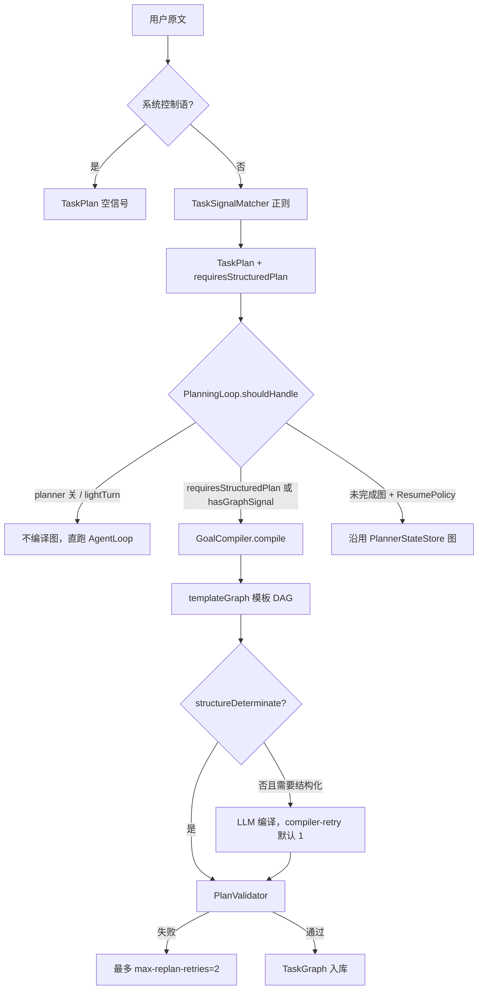

`DecompositionPolicy.hasGraphSignal`：blob（原文+taskGoal）里能抽出路径或 URL 即为真——短「下载这个链接存盘」即使 `requiresStructuredPlan=false` 仍可进规划器。

**模板选择**（`GoalCompiler#templateGraph`）：diagram → 出图模板；fetchWrite → 抓取再写；readThenAnalyze → 表格再分析；researchThenFile → 调研再落盘；否则按 plan 推断能力的单节点或澄清图。

#### 5.3.4 图模型（拆解产出）

| 类型 | 要点 |
|------|------|
| `Goal` | goalId、objective、signals、successCriteria；澄清目标 `TASK_TYPE_CLARIFY` |
| `TaskGraph` | 节点列表；`normalizeForScheduling`、`readyNodes`、`allTerminalSuccess`、`hasCycle` |
| `TaskNode` | capability、dependsOn、doneWhen、toolHint、status |
| `DoneWhen` | `note_required` / `file_exists` / `media_delivered` / `llm_judge` / `command_success` / `validation_passed` |
| `ActionSpec` | 调度器绑出的运行时动作：tool、arguments、acceptance、idempotencyKey |

节点状态（实现时对照 `TaskNodeStatus`）：PENDING / READY / RUNNING / SUCCESS / FAILED / RECOVERING / AWAITING_CONFIRM / CANCELLED 等。

#### 5.3.5 配置

| 键 | 默认 |
|----|------|
| `agent.task-signals.rules.question-max-len` | 80 |
| `agent.task-signals.rules.force-full-on-image-into-doc` | true |
| `agent.task-signals.rules.*-signals` | yml 正则列表 |
| `agent.planner.compiler-retry` | 1 |
| `agent.planner.max-replan-retries` | 2（Java 字段） |
| `agent.planner.planner-timeout-seconds` | 60 |

#### 5.3.6 初级实现清单

1. 写 `TaskSignals` record + `TaskSignalMatcher`（yml 正则 + 少量硬编码扩展名/动词）。
2. `TaskPlanFactory.build` 如上，**steps 留空**。
3. 不要在这里 `switch(intent)`。
4. 图编译放到规划模块，拆解模块只输出「要不要结构化」和信号。

#### 5.3.7 禁止

- 恢复已删除的意图枚举。
- 让 Factory 生成假的 `TaskStep` 列表冒充图。
- 把 `readsFile` 算进 `actionBearing`。

---

### 5.4 工具模块

#### 5.4.1 边界

**做：** 注册、规格、权限、超时、并发、真正执行、把结果变成 `ToolResult`。

**不做：** 决定本轮用哪些工具（`ToolSurface` + `PermissionPolicy`）；不在 Controller 暴露「每个工具一个 REST」。

#### 5.4.2 注册

`ToolRegistry.register`：

- `register(Tool)`：按名 `putIfAbsent`，重名抛 `IllegalStateException`。
- `register(name, description, Map schema, Function)` 或 `Class<? extends ToolParams>`。

**加新工具的固定写法：** `@Component` + `@Autowired ToolRegistry` + `@PostConstruct register()`。不要改 `AgentLoop`。

内置名（`BuiltinTools`）：文件四件套、`http_get/post`、`web_search/extract`、`search_code`、`edit_file`、`exec_command`、`browser_*`（10 个）、`image_generate`、`comfyui_*`、`skill_*`。

其它 `@PostConstruct`：`memory`、`todo`、`ask_user_question`、`delegate_task`、`codebase_search`、`ast_search`、`write_document`、`write_docx`、`write_xlsx`、`edit_document`、`render_diagram`、`agent_environment`。

MCP（`ApplicationReadyEvent`，默认关闭）：名 `mcp__{serverId}__{tool}`。

#### 5.4.3 Pipeline 闸门顺序（必须按序，不能插队）

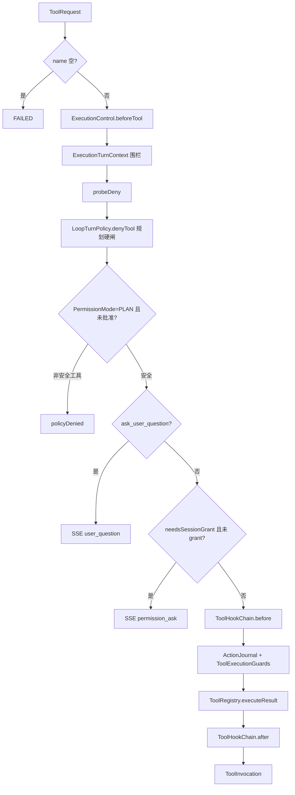

`PLAN_SAFE_TOOLS` / `ASK_DANGEROUS_TOOLS` 以 `PermissionPolicy` 源码为准（含 `mcp__*` 在 Ask 下视为危险）。

#### 5.4.4 结果模型

| 类型 | 取值 |
|------|------|
| `ToolStatus` | SUCCESS / FAILED / TIMEOUT / CANCELLED / AWAITING_USER / UNKNOWN |
| `ToolInvocation.Outcome` | EXECUTED / GATE_DENIED / POLICY_DENIED / PERMISSION_ASK / USER_QUESTION / CONTROL_STOP / FENCE_REJECTED |

`ToolResult.unknown` 会驱动执行模块的 `OUTCOME_UNKNOWN` 停机（可核验工具、`exec_command` 超时 **不** 走 UNKNOWN，见 5.8）。

#### 5.4.5 超时与并发

| 项 | 值 |
|----|-----|
| 全局并发 | `agent.tools.max-concurrency=8` |
| 未知工具默认超时 | 60s（`ToolConcurrencyPolicy.timeoutSecondsOf` 的 default 分支） |
| `exec_command` 外层闸 | 内层默认 120s、上限 600s；外层 = 声明值 + 15s（未声明则为 **135s**） |
| 若干 browser/http/search | 同策略表约 30s |
| 规划节点额外封顶 | `agent.planner.action-timeout-seconds=0` 表示不额外砍 |

`AgentLoop.TOOL_TIMEOUT_SECONDS` 是死表：`resolveToolTimeout` 走 `ToolExecutionGuards` → `ToolConcurrencyPolicy`，不要抄那张 30s 的 `exec_command` 行。

技能目录：`{agent.data-dir}/skills`，默认 `{user.home}/.miniagent/skills`，子目录含 `SKILL.md`。`agent.data-dir` = `MINI_AGENT_HOME` 或 `~/.miniagent`。工作区写保护：`agent.tools.allow-absolute-write=false`；`block-private-network=true`。

#### 5.4.6 初级实现清单

1. `ToolRegistry` + 一个 `read_file`。
2. `ToolPipeline` 先做 1～6 闸，再补 Ask/Journal。
3. 规格过滤：MCP 与非 MCP 分组排序；同时允许 `write_file`+`web_extract` 时自动带上已注册 `mcp__*`（与现网一致）。

#### 5.4.7 禁止

- 在 Loop 里 `switch(toolName)` 直接调文件系统。
- 给每个工具开 REST。
- 把 MCP 写成默认开启。

---

### 5.5 记忆模块

#### 5.5.1 两套门面（不要合成一个上帝接口）

| 门面 | 给谁用 | 方法 |
|------|--------|------|
| `MemoryService` | 提示词 + `memory` 工具 | `retrieveForPrompt`、`add/replace/remove/read`、`promoteUserBlob` |
| `MemoryManager` | 巩固管线 + `/v1/memory` | 事件、条目 CRUD、工作记忆、事实/SOP/episode、`consolidate`/`forget` |

对话路径：上下文只调 `MemoryService.retrieveForPrompt`；任务起止 `AgentChatApplicationService.recordEvent` → `MemoryManager.recordEvent`；结束后 **异步** `consolidate`（线程内必须 `bindOwnerContext` + 绑定用户模型）。

#### 5.5.2 工具 `memory`

| 参数 | 取值 |
|------|------|
| action | add / replace / remove / read |
| target | `memory`（`MemoryKeys.TARGET_MEMORY`）或 `user`（`TARGET_USER`） |

用户画像走语义事实（`DefaultMemoryService.addUserFact`），不要只追加 blob。

#### 5.5.3 读入提示词

`MemoryReadPolicy`：`working` / `longTerm` / `user` / `midterm` / `userMaxChars`。

由 `ContextLoadPolicy.memoryPolicy()` 映射：working←`injectTodo`，longTerm←`injectMemory`，user←`injectUser`，midterm←`injectMidterm`。

`DefaultMemoryService.retrieveForPrompt`：结构化（若有 Manager）+ blob 快照，去重重叠行。policy 全关返回 `""`。

**`injectMidterm` 三套策略都是 false**；`updateMidtermMemory` 主路径无调用方。实现时保留字段即可，不要做「打开即有中期记忆」。

#### 5.5.4 写入管线（事件 → 长期）

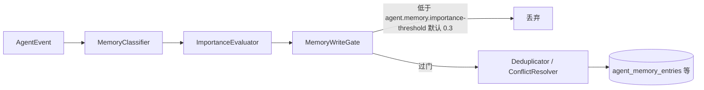

分类规则（`RuleBasedMemoryClassifier`）：用户反馈→USER；工具/任务/错误→EPISODIC；计划变更/事实→SEMANTIC；可复用 payload→PROCEDURAL。

闸门（`agent.memory.gate.enabled` 默认 true）：内容过短（<8 字）、套话、安全扫描。

#### 5.5.5 巩固与工作记忆

- `WorkingMemoryManager`：MySQL `agent_working_memories` + Redis `wm:{sessionId}`，TTL `agent.replica.memory-ttl-seconds` 默认 86400。
- `DefaultConsolidationService`：未处理事件 → episode；可选 LLM 抽事实（`PREDICATE_LEARNED`，`SOURCE_CONSOLIDATION`）；`touch` Redis TTL。

向量：`agent.memory.vector.enabled=true`，`backend=local` 或 `milvus`（维度 1792）。改 embedding 模型必须重建集合。

#### 5.5.6 HTTP

见第 8.6 节 `/v1/memory/*`。REST 不自动等于本轮会注入提示词。

#### 5.5.7 禁止

- 上下文绕过 `MemoryService` 直接 `SELECT * FROM agent_memory_entries`。
- 巩固放在 SSE `end` 之前同步等待。
- 把 blob 和结构化表再抄第三套「记忆中台」。

---

### 5.6 上下文模块

#### 5.6.1 边界

**做：** 本轮 system 字符串、历史切片、todo 挂起/恢复、任务 scopeKey。

**不做：** 调工具、编译图、把工具 schema 写进 `ContextBuilder`（tools 槽贡献者返回空，指导语在 `AgentLoop.bindTurnTools`）。

#### 5.6.2 `ContextLoader.load` 步骤

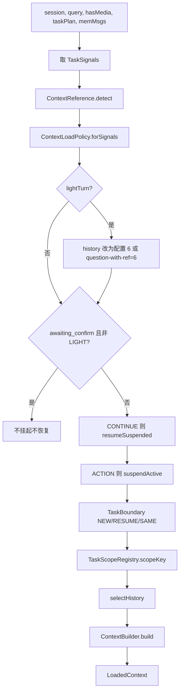

**LIGHT 注意：** record 里 `historyMaxMessages=-1`，Loader **覆盖成 6**。不要只看 record 字面量。

**ACTION：** `suspendActiveTodo=true`。清单未完成→挂起；全是 completed/cancelled→归档清空（防旧计划劫持）。等确认时跳过挂起。

#### 5.6.3 槽位与贡献者（@Order）

| Order | Slot | 内容 |
|------|------|------|
| 10 | IDENTITY | `PromptTemplates.identity()` |
| 20 | AUTHORITY | 权限说明 |
| 25 | QUESTION | 轻问答/点评模式提示 |
| 30 | REFERENCE | 指代提示 |
| 40 | MEMORY | `MemoryService.retrieveForPrompt` |
| 50 | SKILLS | `SkillStore` 摘要（`injectSkills`） |
| 60 | REASONING | 推理+完成约束 |
| 70 | TOOLS | **空** |
| 80 | TODO | `TaskTodoStore.render` |
| 90 | CLOSING | 确认/输出/时钟 |

预算：`agent.context.budget.enabled=true`，`chars-per-token=2.0`，槽 token 见下表。

| slot | 默认 token |
|------|------------|
| identity | 2000 |
| authority | 400 |
| question | 800 |
| reference | 300 |
| memory | 6000 |
| skills | 2000 |
| reasoning | 1500 |
| tools | 4000 |
| todo | 2000 |
| closing | 1500 |
超窗压缩：`max-tokens=512000`，阈值 0.75；`llm-summary-enabled=false` 时硬截断。

#### 5.6.4 历史与指代

- 非指代：按 `historyMaxMessages` 从尾切；`-1` 不裁。
- 指代：`ContextHistorySelector`，优先会话向量（`ref-vector-enabled=true`，`ref-min-score=0.35`），失败回退词重叠（下限 0.15），扫描池 `ref-scan-max=48`，弱代词锚 `ref-pronoun-anchor=4`。

`hasMedia` **不**决定工具面和历史条数，只影响是否拼点评轮提示。

#### 5.6.5 任务隔离

`TaskScope.scopeKey()`：`taskId==0` → `sessionId`；否则 `sessionId#taskId`。规划图、压缩摘要按 scopeKey；**对话历史整段保留**（追问要上文）。Todo 存储键仍是 sessionId，靠挂起文件/字段隔离，不是 `#` 键。

`TaskScopeRegistry` 是进程内 `ConcurrentHashMap`，**重启丢失**。

#### 5.6.6 禁止

- 用「system 边界标记截断历史」做任务隔离（代码已废弃该做法）。
- 问答轮 `historyMaxMessages=0`。
- 在 Builder 里塞工具 JSON schema。

---

### 5.7 规划模块

#### 5.7.1 边界

**做：** 编译/校验/调度/执行提案/验收/恢复；图为唯一事实源。

**不做：** 用 Todo 勾选回写节点成功；把 90 轮套在每个图节点上。

#### 5.7.2 是否接手本轮

`PlanningLoop.shouldHandle`：

1. `agent.planner.enabled`（默认 true）
2. 不是 `lightTurn`
3. `requiresStructuredPlan` **或** `DecompositionPolicy.hasGraphSignal`
4. 否则：有未完成图 **且** `PlannerResumePolicy.shouldResume`（继续词、批准词、或等待确认时的短人话；明确新话题则 false）

不接手 → `NodeExecutor.runDirect`（无围栏），不要进外层图循环。

#### 5.7.3 主循环

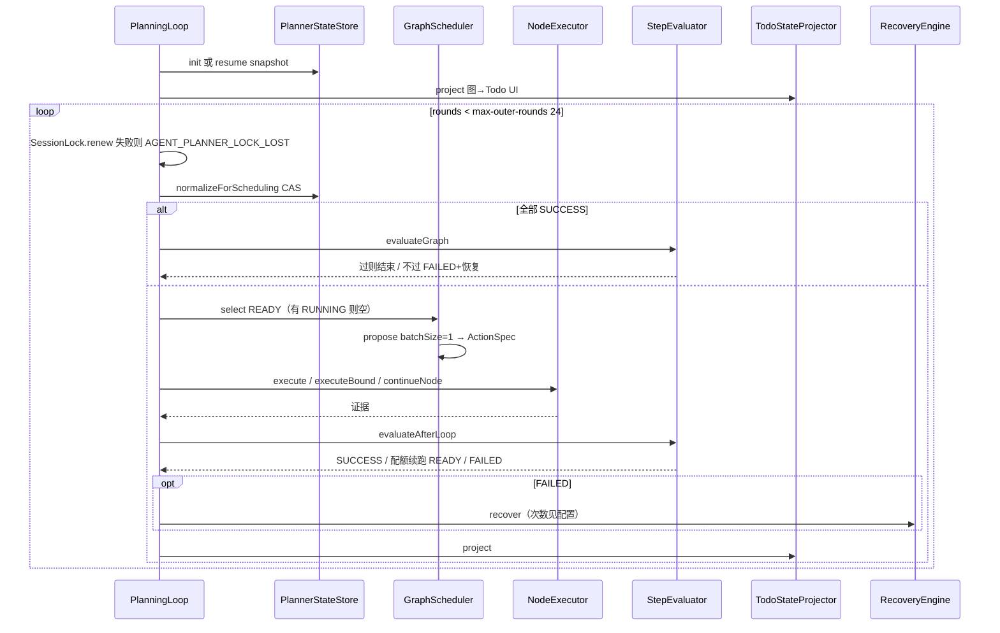

节点内 ReAct：`proposal-max-iterations=8`（含 `browser_*` 时 16）× `proposal-max-chunks=6`。`hard-proposal=true` 时锁工具面、禁止改其它 todo。

围栏：`execute` / `continueNode` / `executeBound` 必须 `ExecutionTurnContext` 有效；`runDirect` 不要围栏。

#### 5.7.4 验收（图 SSOT）

`StepEvaluator`：按 `DoneWhen` 查文件/媒体/命令/llm_judge/`TodoSemanticValidator`。`evaluateGraph` 要求每节点 SUCCESS 且目标 successCriteria 过。

**`agent.planner.strict-eval=true` 写在配置里，但 `StepEvaluator` 源码未分支读取。** 复现时不要假装已有两套宽严逻辑。

`TodoStateProjector.project`：**覆盖**写出 Todo，禁止用 Todo 排名合并回图。确认：`confirmByTodoId` 只把图上 `AWAITING_CONFIRM`→`PENDING`。

#### 5.7.5 恢复配额

| 键 | 默认 |
|----|------|
| `max-recoveries` | 3 |
| `max-local-repair` | 3 |
| `max-replace-tool` | 2 |
| `max-rewrite-graph` | 2 |
| `max-revise-goal` | 1 |

`FailureKind` → `FailureClass`：LOCAL_REPAIR / REPLACE_TOOL / REWRITE_GRAPH / REVISE_GOAL。

**重规划只有两处，都在规划器里，没有独立模块、没有「重新规划」按钮：**

| 时机 | 代码 | 上限 |
|------|------|------|
| 出图时 `PlanValidator` 拒绝 | `compileAndValidate` → `compileWithCorrection` | `max-replan-retries` 默认 **2**（Java 字段，yml 未写则用此值） |
| 节点失败且分类为改图/改目标 | `tryLlmReplan`：LLM 重编未完成部分，`mergeKeepSuccess` 保留已 SUCCESS 节点 | 总恢复 `max-recoveries=3`；改图 2、改目标 1 |

LOCAL_REPAIR / REPLACE_TOOL **不算**重规划：同一节点 PENDING 重试或换工具。直跑路径没有图，因此没有重规划。

状态键：`PlannerStateStore.key` = `TaskScopeRegistry.scopeKey`，**不是**裸 sessionId。

#### 5.7.6 禁止

- Todo 完成勾选当作节点 SUCCESS。
- 节点循环用 `max-iterations=90`。
- `shouldHandle==false` 时还去 `init` 一张空图。
- 现网 `PlanningLoop#run` 直跑回退有一条字面量 90（与 `ExecutionProperties` 重复）。复现时注入配置，不要再抄第四个上限。

---

### 5.8 执行模块

#### 5.8.1 边界

**做：** 预算租赁、ReAct 轮次、调 LLM、经 Pipeline 跑工具、停机原因。

**不做：** 解析用户意图、持久化图。

#### 5.8.2 预算 `ExecutionControl`

`start(sessionId, tenantId)` 租约：截止 `now+deadlineMs`、工具次数、估算 token。

| StopReason | 触发 |
|------------|------|
| CANCELLED | `cancel` / 用户取消 |
| DEADLINE_EXCEEDED | 墙钟 |
| TOOL_BUDGET_EXCEEDED | 工具次数 ≥ 120 |
| TOKEN_BUDGET_EXCEEDED | 估算 token ≥ 2000000 |
| TENANT_QUOTA_EXCEEDED | 日配额 |

`beforeTool` / `afterModelTokens` 每次心跳。`finish` 必须在 `finally`。

`ExecutionProperties`：`max-iterations=90`，`subagent-max-iterations=25`，`capIterations` 把调用方请求压到封顶。

#### 5.8.3 AgentLoop 一轮

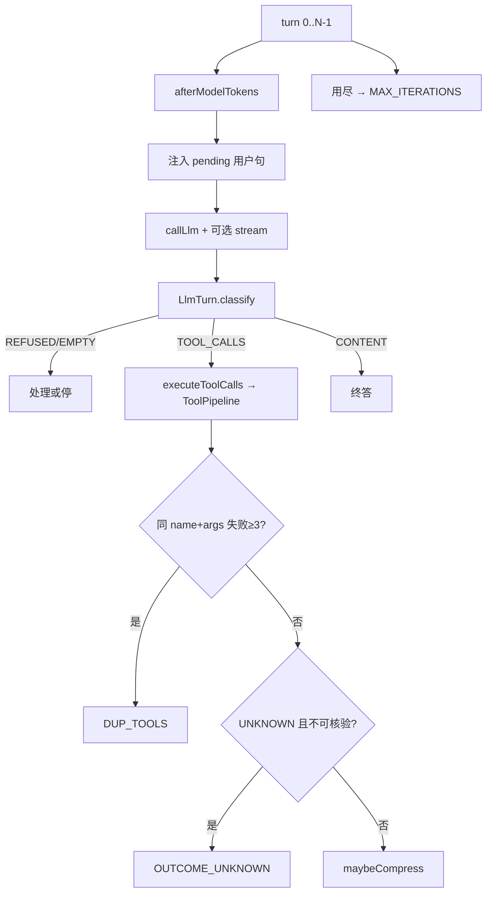

`LlmTurn.classify`：安全拒答 REFUSED；无 AiMessage EMPTY；有 tool_calls TOOL_CALLS；空白 EMPTY；厂商拒答包 REFUSED；否则 CONTENT。连续截断 4 次停。

探索类调用上限 `MAX_EXPLORATION_CALLS=40`。

#### 5.8.4 超时结果

`timeoutToolResult`：

- `ask_user_question` → FAILED CANCELLED
- 只读 / 幂等 / `isOutcomeVerifiable` → FAILED TIMEOUT，可重试
- **`exec_command` → FAILED TIMEOUT，明确不是 UNKNOWN**（避免整轮被误杀）
- 其它有副作用 → `ToolResult.unknown` → 可触发 OUTCOME_UNKNOWN

#### 5.8.5 RunScope 与围栏

`RunScope.capture()` 快照 ThreadLocal（会话、权限、子代理、模型）。规划提案必须 `ExecutionTurnContext.open`，否则 `NodeExecutor.requireFence` 失败。

`LoopTurnPolicy`：`hardGate`、`denyTool`、`denyTodoArgs`、`allowedTools`。规划提案时 hardGate=true。

`ToolResultProjector`：目前只把成功的 `web_search` JSON 收成最多 5 条可读列表。

#### 5.8.6 子代理

`delegate_task` → 内层 `AgentLoop`，迭代 `capSubagentIterations`（25），工具白名单来自任务；内层再嵌套 `delegate_task` 会被剥掉。

#### 5.8.7 禁止

- 在 Loop 里写死第二个 90。
- 把规划节点上限和直跑上限当成同一个数。
- 超时一律 UNKNOWN。

---

### 5.9 任务闭环模块

#### 5.9.1 边界

闭环 = **开计划 → 推进 → 等人 → 验收 → 完成或换任务归档/挂起**。

两条闭环不要混：

| 路径 | 完成谁说了算 | Todo 角色 |
|------|----------------|-----------|
| 规划图 | `StepEvaluator` | 单向投影 |
| 直跑 | 模型 `todo` 工具 + `TodoPlanStopHook` | 模型维护的清单 |

#### 5.9.2 Todo 工具

`todo` action：`set` / `update` / `list` / `clear` / `reopen` / `confirm`。

`done_when` 前缀与图上 `DoneWhen` 对齐：`file_exists:`、`media_delivered`、`note_required`、`llm_judge:`。

硬闸下 `LoopTurnPolicy.denyTodoArgs` 可禁止改其它项。

存储：`agent.todo.storage=db`（表 `agent_session_todos`），或文件 `agent.todo.persist-dir`。变更后 `publishTodoUi` → SSE `todo`。

#### 5.9.3 停机钩子

`TodoPlanStopHook.evaluate`：

- 放行：轻问答、`plannerOwned`（实际等于本轮 `hardGate()`，即规划提案轮）、媒体已交付。
- 拦截（各最多提醒 2 次）：需要结构化计划但还没 `todo.set`；有清单但还有可跑的未完成项。

规划轮验收不靠这个钩子，靠 StepEvaluator。

#### 5.9.4 等人

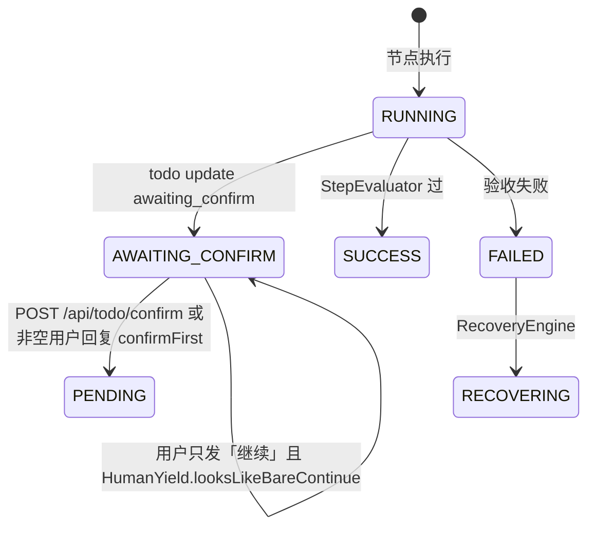

`POST /api/todo/confirm`：有规划快照则 `TodoStateProjector.confirmByTodoId` + `commit` + `project`；否则 `TaskTodoStore.confirm`。

#### 5.9.5 换任务

下一轮 ACTION 且有活动清单：

- 全终态 → **归档清空**（完成任务不得再注入/推 UI）
- 未完成 → **挂起**（「继续」CONTINUE 策略 `resumeSuspendedTodo` 捞回）
- `awaiting_confirm` 且非 LIGHT → **不挂起**

NEW 边界让 `taskId` 自增，规划读新 `sessionId#taskId`，旧图留在旧 key。

#### 5.9.6 端到端（初级对照）

1. 用户复杂任务 → 拆解要图 → 规划编译 → 投影 Todo → SSE 出列表。
2. 调度 READY 节点 → 执行 → 验收 → 投影。
3. 模型要人确认 → 前端确认接口 → 节点回到 PENDING。
4. 全 SUCCESS + evaluateGraph → 结束。
5. 用户新开一个动手问题 → 旧清单归档或挂起 → 新 scope → 不会顶着上一张完成计划。

#### 5.9.7 禁止

- 用 Todo 状态写回 `TaskNode.status=SUCCESS`。
- 完成清单在新 ACTION 轮不清空（旧 bug：新问题仍显示 2/2 旧计划）。
- 把 `StopContext.plannerOwned` 理解成「库里有图」——它等于本轮 hardGate。

### 5.10 前端对话页

`mini-agent-app/src/main/resources/templates/chat.html`（样式内联；`spring.thymeleaf.cache=false` 时改 HTML 刷新即可）。

已实现 UI 行为（以当前模板为准）：

- 顶栏无模型选择；模型/主题/退出在侧栏「设置」。
- 侧栏折叠为窄轨箭头，新对话在侧栏图标。
- 任务条、回复列、输入框同一 `--content-w: 800px` + `--page-pad`。
- SSE 消费：`thinking` `token` `seal` `progress` `todo` `subgoal` `permission_ask` `user_question` `end` `error`。

前端不是独立 SPA 工程；复现时可以仍用服务端模板，不必先上 React。

### 5.11 轨迹

`TraceRecorder` 写入 `agent_trace_steps`。页面 `GET /trace`。列表/汇总/按 execution 分组见第 9 章 API。实时推送事件名 `trace`（`GET /api/traces/stream`）。

`TraceRecorder.isFailedResult` 用文本是否包含 `"error"` 判断失败——**源码字符串里带 error 的成功结果会被误判**。实现时要么沿用（与现网一致），要么改判定但不要悄悄当「已修好」写进功能清单。

---

## 6. 数据架构

### 6.1 存储选型（已落地）

| 数据 | 组件 | 说明 |
|------|------|------|
| 账号/会话元数据/消息/任务 | MySQL | 库名默认 `mini_agent` |
| JWT 滑动会话 | Redis | 键 `session:jwt:{jti}` |
| 规划图 / Todo JSON | MySQL `agent_session_planner` / `agent_session_todos` | `storage=db` |
| 上传与生成媒体 | `{data-dir}/media` | 不是 yml 里已弃用的 `file.upload.base-dir` |
| Skills / workspace | `{data-dir}/skills`、`workspace` | |
| 向量 | 本地 JSON 或 Milvus | 由 `backend` 切换 |
| 轨迹 | `agent_trace_steps` | |

默认 **`spring.flyway.enabled=false`**，`jpa.hibernate.ddl-auto=update`。生产 profile 才 `flyway.enabled=true` 且 `ddl-auto=validate`。初级环境不要同时开 Flyway 和乱改实体。

### 6.2 核心表（V1～V6，V7 已删意图表）

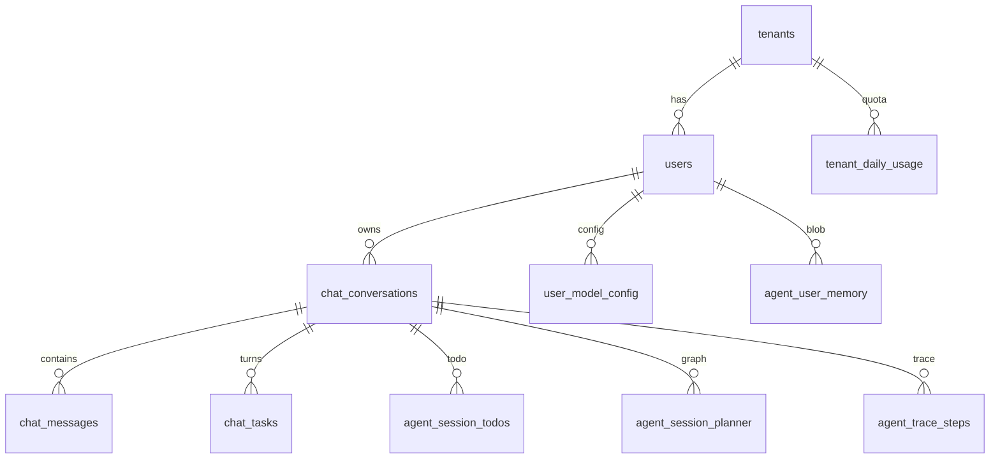

| 表 | 用途 |
|----|------|
| `users` / `tenants` | 账号与租户；`users.role`、`enabled` |
| `chat_conversations` / `chat_messages` | 会话与消息；`deleted` 软删 |
| `chat_tasks` | 一问一答任务行，供历史分页；`deleted` |
| `file_uploads` | 上传元数据 |
| `user_model_config` | 用户覆盖的 baseUrl/model/apiKey |
| `agent_user_memory` | 用户记忆 blob |
| `agent_task_runs` | 运行中/完成/失败 |
| `agent_session_todos` / `agent_session_planner` | Todo 与图 JSON |
| `agent_events` / `agent_episodes` / `agent_memory_entries` / `agent_semantic_facts` / `agent_procedures` | 结构化记忆 |
| `agent_working_memories` | 工作记忆 |
| `agent_token_usage` / `tenant_daily_usage` | 用量 |
| `agent_trace_steps` | 轨迹 |
| `admin_audit_log` | 管理审计 |
| `auth_sessions` | DB 会话行（管理撤销用，非 JWT 主存） |
| `agent_session_permissions` | **表在，运行时 SessionPermissionStore 是内存** |

V7 删除 `intent_rule_*`。不要再建意图规则 CRUD。

### 6.3 生命周期

- 会话软删：`/api/conversation/delete` 标 `deleted`，查询带 `deletedFalse`。
- 日配额时区：`agent.quota.zone-id` 默认 `Asia/Shanghai`；租户 `daily_token_limit=0` 表示不限额。
- 备份/归档策略：**代码未实现**，不要写进功能。

---

## 7. 技术选型（对照现状）

| 类别 | 选定 | 版本/位置 | 说明 |
|------|------|-----------|------|
| 语言 | Java | 21 | 根 POM |
| Web | Spring Boot | 3.4.5 | 单体 |
| LLM SDK | LangChain4j | 1.15.0 | OpenAI 兼容 |
| 模板 | Thymeleaf | Boot 自带 | 对话页 |
| ORM | Spring Data JPA + Hibernate | ddl-auto=update（dev） | |
| 迁移 | Flyway | 生产才启用 | |
| 会话 | JWT + Redis TTL | | 不是纯 server session |
| 密码 | BCrypt | strength 10（dev） | |

**刻意债务（代码里已标明或可观测）**

| 决策 | 现状 | 不要当成已完成升级 |
|------|------|---------------------|
| replica | `local` | 不能按「多实例 SSE」去测 |
| 权限会话 | 内存 Store | 进程重启丢失 Plan 批准 |
| Flyway | dev 关闭 | 表结构靠 Hibernate update |
| 意图层 | 已删除 | 用 TaskSignals |

---

## 8. 接口设计

统一成功/失败 JSON（SSE 除外）：

```json
{ "success": true, "code": null, "message": null, "data": {} }
{ "success": false, "code": "CHAT.01.01", "message": "请输入有效内容", "data": null }
```

错误码枚举：`com.miniagent.common.ErrorCode`，格式 `模块.功能区.序号`。新错误先加枚举再引用。

**未套 ApiResponse 的接口（实现时保持兼容，不要擅自包一层）：**  
`POST /chat/stream`、`GET /chat/stream/attach`、`GET /api/traces/stream`、`GET /api/traces/node-catalog`、`GET /api/planner/health`、`GET /api/planner/metrics`、`GET/PUT /api/model-config`（自带 `success` 字段的 Map）。

### 8.1 页面与认证

| 方法 | 路径 | 鉴权 | 说明 |
|------|------|------|------|
| GET | `/` | 可选 | 未登录 `login`，已登录 `chat` |
| POST | `/api/login` | 无 | `{username,password}` → `{user,token}` + Cookie |
| POST | `/api/register` | 无 | 注册关闭或弱密码时也返回 `AUTH.01.02`（实现要知这个粗糙点） |
| GET | `/api/logout` | 无 | 重定向 `/` |
| GET | `/api/auth-status` | 无 | `{authenticated,...}` |

### 8.2 对话与会话

| 方法 | 路径 | 鉴权 | 说明 |
|------|------|------|------|
| POST | `/chat/stream` | JWT | 主对话，SSE |
| GET | `/chat/stream/attach` | JWT | 重连；无活流时事件 `gone` |
| POST | `/api/chat/append-message` | JWT | 运行中追加用户句 |
| POST | `/api/chat/cancel` | JWT | `ExecutionControl.cancel` |
| GET | `/api/task-status` | JWT | `{sessionId, running}` |
| GET | `/api/conversations` | JWT | 列表 |
| GET | `/api/conversation` | JWT | 单个 |
| GET | `/api/conversation/messages` | JWT | `page/size`，`{tasks,hasMore}`，任务按 createdAt 倒序再 reverse 成时间正序 |
| POST | `/api/conversation/delete` | JWT | 软删 |
| GET | `/api/token-usage` | JWT | 本会话计数 |
| GET | `/api/token-usage/all` | JWT | **固定返回 `{}`** |

**ChatRequest 字段**：`message` `sessionId` `images` `files` `fileRefs` `mediaRefs` `role` `permissionMode` `confirmPolicy`。

`role` 取值（前端约定）：`tester/developer/pm/designer/security/ops/dba/architect/tech_writer`。

### 8.3 SSE 事件名（实现前端必须对齐字符串）

| event | 载荷 | 何时 |
|-------|------|------|
| `session` | sessionId | attach |
| `user` | 首条用户消息 | 开始/回放 |
| `thinking` | 增量字符串 | 模型思考 |
| `token` | 增量字符串 | 正文 |
| `seal` | `""` | 段边界（前端封存上一块正文） |
| `progress` | 状态句 | 进度 |
| `subgoal` | `{text,done,total}` | 子目标 |
| `todo` | `{items:[...]}` | 计划列表 |
| `permission_ask` | JSON | 危险工具确认 |
| `user_question` | JSON | `ask_user_question` |
| `append_ack` | 截断后的追加文本 | 中途消息 |
| `end` | 最终回答 | 完成 |
| `error` | 文本 | 失败 |
| `gone` | `""` | attach 无通道 |
| `trace` | 轨迹步进 | `/api/traces/stream` |

### 8.4 权限、待办、模型、MCP、上传、媒体

| 方法 | 路径 | 说明 |
|------|------|------|
| GET/PUT | `/api/permission-mode` | 读/改 mode、confirmPolicy；`action=approve_plan\|grant_ask` |
| POST | `/api/todo/confirm` | `{sessionId,id}` |
| GET/PUT | `/api/model-config` | 预设 + 自定义覆盖；Key 不回显明文 |
| GET | `/api/mcp/status` | enabled、工具数 |
| POST | `/api/mcp/refresh` | 可选 `{serverId}` |
| POST | `/api/upload` | multipart `file` + `sessionId` |
| GET | `/api/generated-media/{owner}/{filename}` | 属主或 SYSTEM_ADMIN |
| GET | `/api/conversation-media/{sessionId}/{filename}` | 会话属主或管理员 |

### 8.5 轨迹与规划健康

| 方法 | 路径 | 说明 |
|------|------|------|
| GET | `/trace` | 页面 |
| GET | `/api/traces` | 步骤列表 |
| GET | `/api/traces/executions` | 按 execution 分组 |
| GET | `/api/traces/summary` | 汇总 |
| GET | `/api/traces/stream` | SSE `trace` |
| GET | `/api/traces/node-catalog` | 节点目录，**非** ApiResponse |
| GET | `/api/planner/decisions` | 规划决策步 |
| GET | `/api/planner/health` | 规划子系统 |
| GET | `/api/planner/metrics` | 计数 Map |

### 8.6 记忆 REST（`/v1/memory`，均需 JWT）

| 方法 | 路径 |
|------|------|
| POST | `/v1/memory/events` |
| POST/GET/PATCH/DELETE | `/v1/memory/memories`、`/memories/{id}`、`/memories/search` |
| POST | `/v1/memory/context` |
| POST/GET | `/v1/memory/facts`、`/procedures` |
| GET | `/v1/memory/episodes/recall` |
| POST | `/v1/memory/consolidate`、`/forget` |
| GET | `/v1/memory/stats` |

请求体为 memory 模块 `com.miniagent.memory.model.*`，实现时打开那些类抄字段。

### 8.7 管理 `/api/admin`

tenants CRUD、users CRUD、reset-password、revoke-sessions、audit 分页。**HTTP 未按 SYSTEM_ADMIN 拦截**（见局限）。

### 8.8 健康

`GET /actuator/health`、`/actuator/info`、`/actuator/metrics`（暴露列表在 yml）。Redis health 在默认 profile **关闭**。

---

## 9. 部署与运行

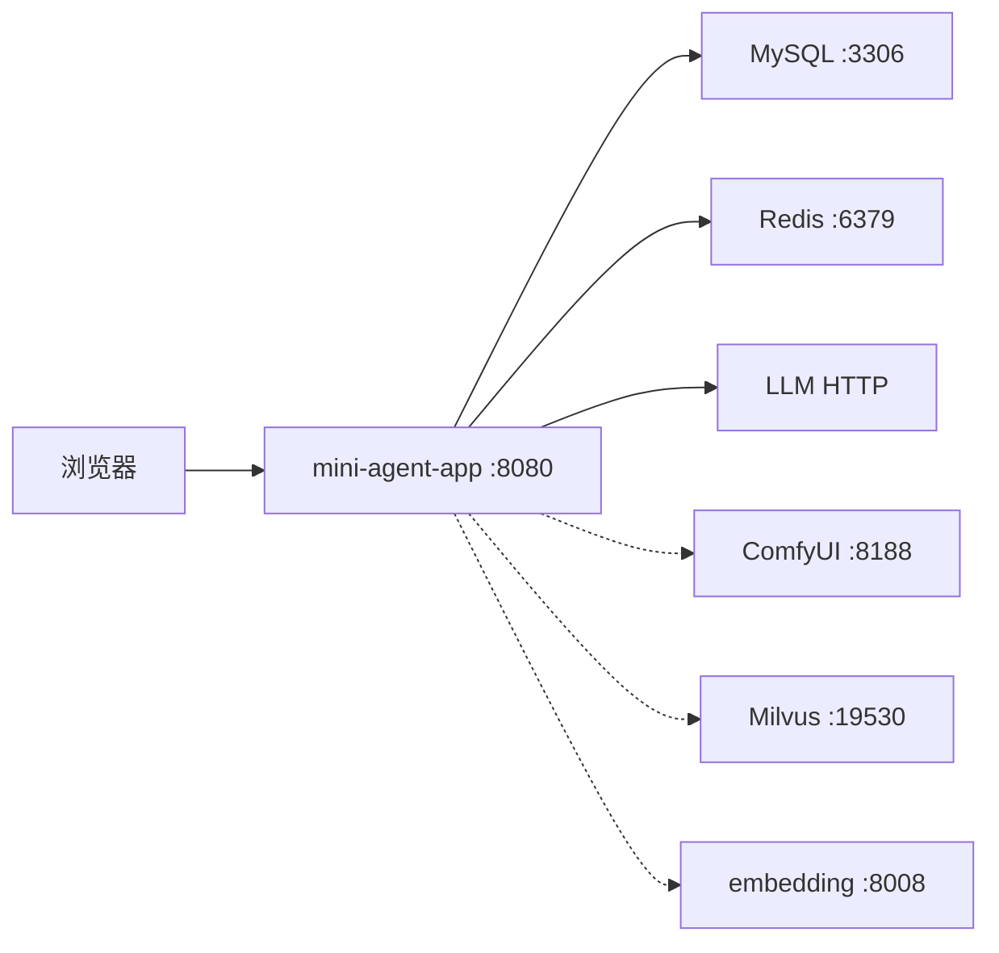

单机默认只强依赖：**8080 进程 + MySQL + Redis（JWT）+ 可达的 LLM**。ComfyUI/Milvus/embedding/MCP 都是可选。

| 进程 | 端口 | 重启 |
|------|------|------|
| Spring Boot | 8080 | 进程级 |
| MySQL | 3306 | 外部 |
| Redis | 6379 | 外部；没 Redis 则登录会话不能按设计工作 |
| ComfyUI | 8188 | 仅当用 comfyui_* 工具 |
| embedding | 8008 | 代码库/指代向量 |

**CI/CD**：仓库是 Maven 多模块。本地：`.\mvnw.cmd -pl mini-agent-app -am spring-boot:run`（Windows）。本文不虚构流水线。

数据目录：`MINI_AGENT_HOME` 或 `~/.miniagent`，不要写进 git。

---

## 10. 扩展点（已有，按现接口扩）

| 扩展 | 做法 |
|------|------|
| 新工具 | `ToolRegistry.register`，经 `ToolPipeline` |
| 新 MCP 服务器 | yml `agent.mcp.servers`，启用 `enabled` |
| 新技能 | `{data-dir}/skills/<name>/SKILL.md` |
| 新模型预设 | `agent.models.presets` |
| 新任务信号 | `agent.task-signals.rules.*` 加正则，不要恢复意图枚举 |
| 上下文贡献 | `SystemContextContributor` / `ContextContributorConfiguration` 已有槽位 |

不要为「将来可能多个实现」先抽只有一个实现的 interface。

---

## 11. 非功能（已实现部分）

| 类别 | 现状 |
|------|------|
| 认证 | JWT Cookie + Redis TTL |
| CSRF | Cookie + Header |
| 限流 | 每分钟次数 |
| 租户配额 | 日 token，0=不限 |
| 路径穿越 | 文件工具校验 |
| SSRF | `block-private-network` |
| 密钥 | 用户模型 Key 可加密配置 `model-config-encryption-key`；**yml 里不要提交真实 Key** |
| 观测 | actuator health/metrics；业务 DEBUG 日志；轨迹表 |

高可用多活、自动 failover：**未实现**。

---

## 12. 风险（对复现者）

| 风险 | 概率 | 影响 | 应对（按现状） |
|------|------|------|----------------|
| 全局 LLM Key 401 导致巩固失败 | 中 | 中 | 巩固线程必须 bind 用户模型（已做） |
| 长工具超时 `OUTCOME_UNKNOWN` 整轮停 | 中 | 高 | 与现网一致；不要用 TTS 假唱当成功 |
| 文本含 `"error"` 被轨迹判失败 | 中 | 中 | 知悉即可 |
| 管理接口未角色门禁 | 高 | 高 | 复现时至少在 Security 加 ROLE 检查，但那是相对当前代码的加固，不是已有功能 |
| 把意图模块抄回来 | 中 | 高 | 禁止；用 TaskSignals |

---

## 13. 已知局限（未实现 / 已删除 / 未接线）

明确标「未实现」，初级工程师 **不要做**：

1. **意图分类子系统**：Java 包已删，V7 掉表。用 `TaskSignals`。
2. **中期记忆注入**：策略恒 false，无生产者。
3. **`GET /api/token-usage/all`**：返回空对象。
4. **`agent_session_permissions` 表**：运行时权限在内存。
5. **admin 角色 HTTP 门禁**：注释写了 SYSTEM_ADMIN，`SecurityConfig` 未配。
6. **revoke-sessions 立即失效 JWT**：未打通 Redis。
7. **Flyway 在默认 profile**：关闭。
8. **MCP**：默认关闭。
9. **水平扩展 SSE**：`replica.mode=local`。
10. **独立前端工程 / 移动端 / 训练平台**：无。
11. **`reset` SSE**：处理函数有，主路径未 publish。
12. **`PlanningLoop` 回退路径字面量 90**：与配置重复，复现时不要再引入第四个上限。

---

## 14. 初级工程师落地顺序（按本仓库结构复现）

目标：做出「能登录、能流式对话、能调一个工具、能选规划或直跑」的同构系统，而不是另写一套 Python Demo。

### 阶段 A — 能跑的空壳（1～2 天）

1. 建 6 个 Maven 模块，依赖方向与第 3.3 节完全一致。
2. `mini-agent-app` 引入 Spring Web + Security + Thymeleaf。
3. `ApiResponse` + `ErrorCode` + 全局异常转 JSON。
4. `GET /` 返回简单 chat 页；`POST /api/login` 先可用内存用户，再换 JPA。

验收：浏览器能打开页面；未登录 JSON 失败码为 `AUTH.02.01`。

### 阶段 B — 直跑 Agent（3～5 天）

1. `ToolRegistry` + 一个 `echo` 或 `read_file`。
2. `AgentLoop`：for 循环 + LLM tool_calls + `ToolPipeline`（可先只有 registry 一段，再补权限）。
3. `ExecutionProperties`：`max-iterations=90`，`subagent` 先不做。
4. `POST /chat/stream` 用 `SseEmitter` 推 `thinking`/`token`/`end`。
5. ChatMemory 窗口 64 条。

验收：用户说「读某文件」会发 tool_call，结果回到模型再出终答；循环不会超过 90。

### 阶段 C — 信号与上下文（2～3 天）

1. `TaskSignals` 12 布尔 + yml 正则。
2. `ContextLoadPolicy` 三套；ACTION 必须挂起上一未完成 Todo。
3. `ContextLoader` + 槽位预算。

验收：「你好」不带出上一张已完成计划；「继续」能恢复挂起清单。

### 阶段 D — 规划内核（4～6 天）

1. `PlannerStateStore` JSON 图。
2. `PlanningLoop.shouldHandle` 条件与现网一致。
3. `NodeExecutor` 调 `AgentLoop`，节点上限 8×6，不要用 90。
4. `TodoStateProjector` 单向投影；完成只认 StepEvaluator。

验收：复杂任务出图；Todo UI 与图一致；完成一步只改图再投影。

### 阶段 E — 产品能力（按需）

权限模式 → 浏览器/生图工具 → 记忆巩固 → 轨迹页 → MCP。每一项都对照第 5、8 章的类名和事件名，禁止自创第二套 SSE 名字。

### 阶段 F — 不要做的捷径

- 不要用「意图枚举」替代 `TaskSignals`。
- 不要在 Controller 里直接调 ChatModel 跳过 Loop。
- 不要给每个工具单独 REST。
- 不要把 90 和 25 改成「更合理」的数，除非产品明确改配置（现网默认必须可回归）。

---

## 15. 关键源码索引

| 主题 | 路径 |
|------|------|
| 对话入口 | `mini-agent-app/.../MiniAgentChatPageController.java` |
| 编排 | `mini-agent-app/.../AgentChatApplicationService.java` |
| 直跑 | `mini-agent-loop/.../AgentLoop.java` |
| 规划 | `mini-agent-planner/.../PlanningLoop.java` |
| 信号 | `mini-agent-loop/.../task/TaskSignals.java` |
| 上下文策略 | `mini-agent-loop/.../context/ContextLoadPolicy.java` |
| 工具管道 | `mini-agent-loop/.../execution/ToolPipeline.java` |
| 权限 | `mini-agent-loop/.../permission/PermissionPolicy.java` |
| 执行预算 | `mini-agent-loop/.../core/ExecutionProperties.java` |
| 默认配置 | `mini-agent-app/src/main/resources/application.yml` |
| 错误码 | `mini-agent-common/.../ErrorCode.java` |
| SSE 常量 | `mini-agent-common/.../MessageConstants.java` |

---

*Mini Agent · 本文只描述仓库已实现行为。配置默认值以 `application.yml` 为准；生产差异见 `application-prod.yml`。*
