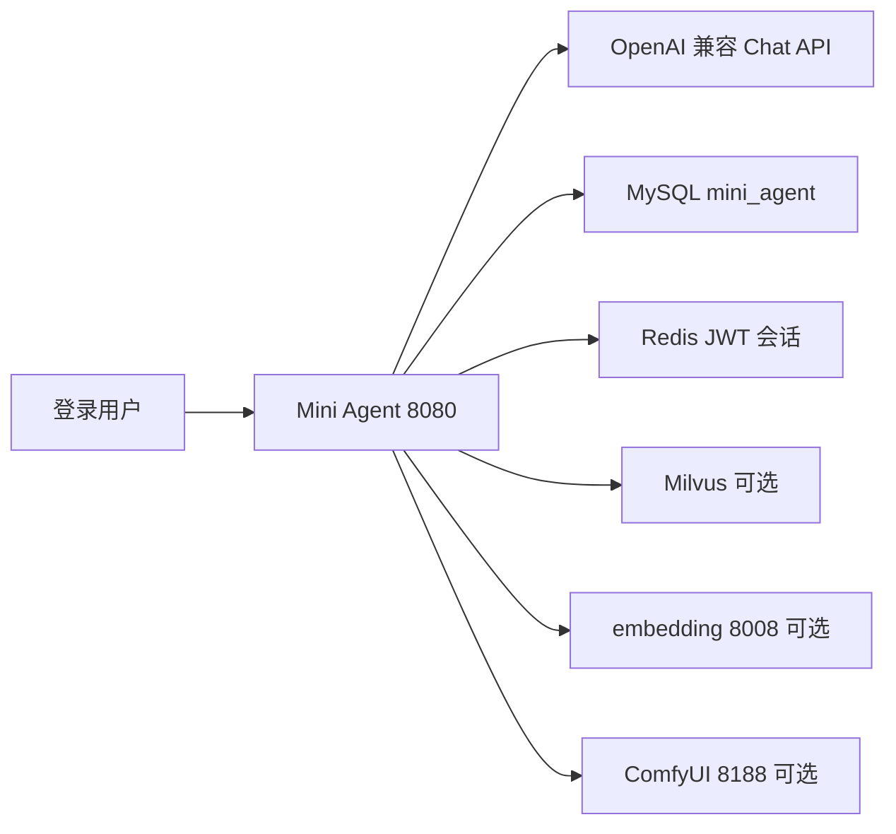
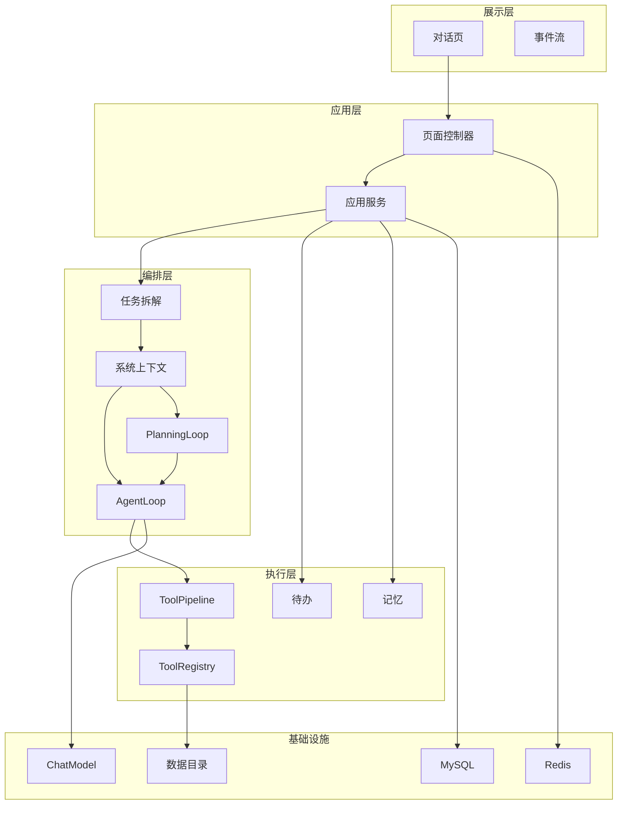
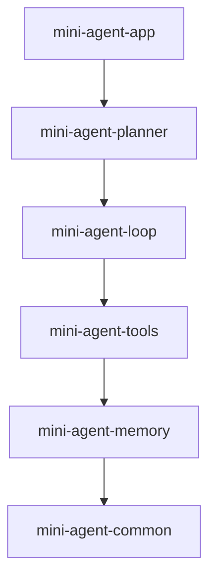
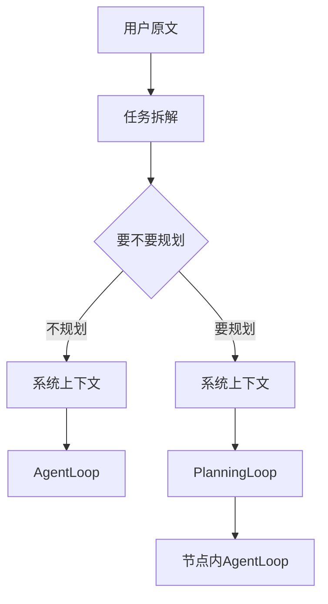
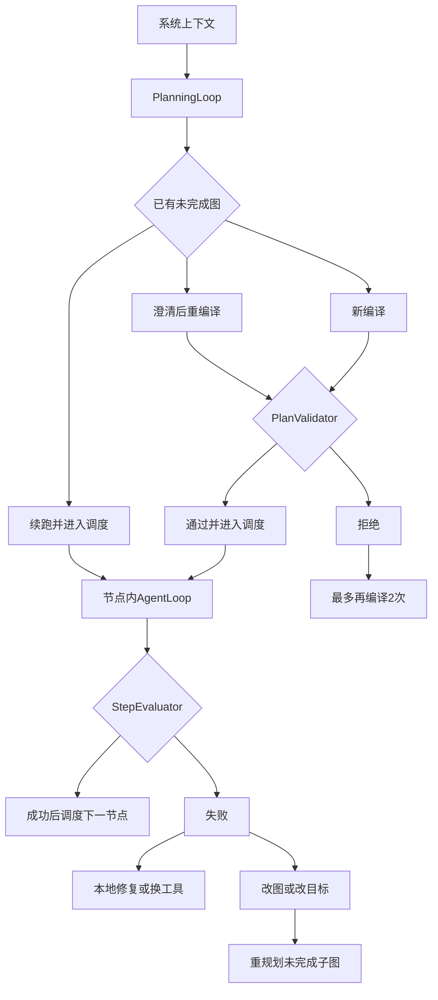
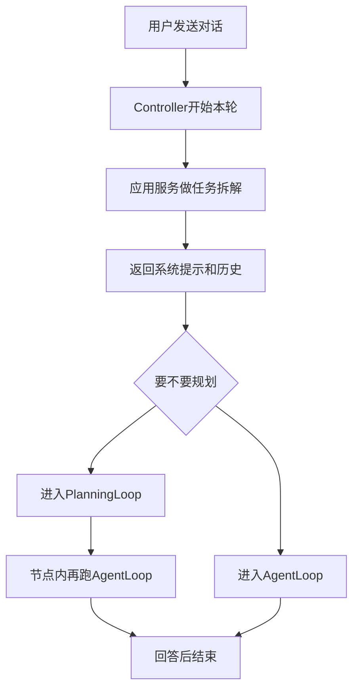
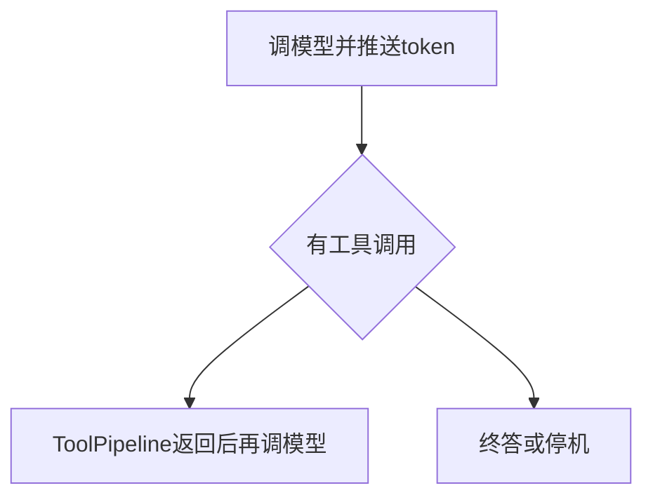
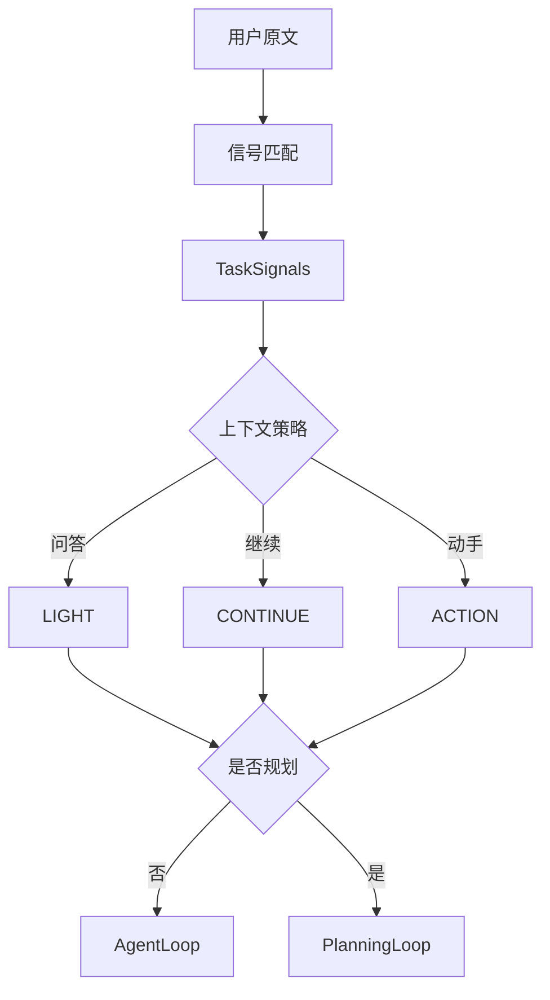

# Mini Agent · 详细设计文档

> **依据**：仓库当前源码与 `mini-agent-app/src/main/resources/application.yml`（默认 profile）。  
> **日期**：2026-09-22。  
> **原则**：只写已经实现的行为。未接线、已删除、配置写了但主路径不用的能力，放在第 13 章，不要当成已具备能力去实现。  
> **本文是唯一详细设计文档。** 初级工程师按第 14 章落地。类名、配置键、SSE 事件名以本文为准。

---

## 1. 文档说明

| 项目 | 内容 |
|------|------|
| **文档名称** | Mini Agent 详细设计（可按模块复现） |
| **版本号** | V2.0 |
| **状态** | 按代码反构，非愿景稿 |
| **代码根** | Maven 聚合工程 `mini-agent-springboot` |
| **Java / Spring / LC4j** | Java 21 / Spring Boot 3.4.5 / LangChain4j 1.15.0（根 `pom.xml`） |

**给初级工程师的读法**

1. 先看第 3.5 节的总图。不规划的轮次（含「你好」这种简单回答）**必须经过系统上下文**，再进入 `AgentLoop`。
2. 第 4 章是一轮 HTTP 对话的时序。第 5 章按模块写怎么实现。
3. 第 14 章是落地顺序。第 13 章是不要做的事。

---

## 2. 项目范围与功能点

### 2.1 系统是什么

Mini Agent 是 **单进程 Spring Boot Web 应用**：浏览器打开 `http://127.0.0.1:8080/`，登录后对话。服务端用 OpenAI 兼容 Chat Completions（默认 MiMo v2.5）驱动 **ReAct 循环**（`AgentLoop`）或 **任务图规划循环**（`PlanningLoop`）。两条路在调用模型之前都先装好系统上下文。工具走统一入口 `ToolPipeline`，过程通过 **SSE** 推到前端。

它不是：独立训练平台、多租户水平扩展集群（默认 `agent.replica.mode=local`）、也不是已删除的「意图分类」子系统。

### 2.2 用户角色（代码里真实存在）

| 角色 | 入口 | 能做什么 |
|------|------|----------|
| 未登录用户 | `GET /` → `login.html` | 登录；`agent.auth.registration-enabled=true` 时可注册 |
| 登录用户 | `chat.html` | 对话、上传、选模型、权限模式、待办确认、看自己的会话/轨迹 |
| `SYSTEM_ADMIN` | `/api/admin/*` | 租户/用户/审计接口已写；HTTP 层目前只要求已登录，见第 13 章 |

### 2.3 功能点清单（已实现）

| 编号 | 功能点 | 落点 |
|------|--------|------|
| F01 | 账号登录/注册/退出，JWT Cookie + Redis 滑动 TTL | `JwtSessionService`、`/api/login` |
| F02 | 对话页：侧栏历史、设置、SSE 流式思考与正文 | `templates/chat.html`、`POST /chat/stream` |
| F03 | 任务信号：从用户原文用正则抽事实，不做意图枚举 | `TaskSignalMatcher`、`agent.task-signals.rules` |
| F04 | 系统上下文：每一轮都装，简单问答用 LIGHT 策略，不是空上下文 | `ContextLoader`、`ContextLoadPolicy` |
| F05 | 直跑 Agent：ReAct，上限 `agent.execution.max-iterations`（默认 **90**） | `AgentLoop` |
| F06 | 规划 Agent：图为事实源，Todo 只是投影；节点内再跑 AgentLoop | `PlanningLoop`、`PlannerStateStore` |
| F07 | 子代理：`delegate_task`，内层上限 **25** | `DelegateTaskTool`、`subagent-max-iterations` |
| F08 | 统一工具管道：权限、确认、超时、死循环 | `ToolPipeline` |
| F09 | 内置工具：文件/命令/浏览器/搜索/生图/ComfyUI/技能/文档等 | `BuiltinTools` 及各 `*Tool` |
| F10 | MCP：可选，工具名 `mcp__{serverId}__{tool}` | `McpToolBridge`，默认 `agent.mcp.enabled=false` |
| F11 | 权限模式：default / plan / accept_edits / ask | `PermissionMode`、`PermissionPolicy` |
| F12 | 待办 `todo` 工具 + 前端任务条 | `TodoTool`、`TaskTodoStore`、SSE `todo` |
| F13 | 记忆：blob + 结构化；巩固异步 | `MemoryService`、`MemoryController` |
| F14 | 会话历史窗口 `agent.chat-memory.max-messages` 默认 **64** | `ChatMemoryConfig` |
| F15 | 轨迹落库 + `/trace` 页 + SSE `trace` | `TraceRecorder`、`agent_trace_steps` |
| F16 | 上传文件/图片/音视频（音视频源文件约 35MB） | `/api/upload`、`agent.multimodal.*` |
| F17 | 租户日 token 配额、并发任务上限 | `DbTenantTokenQuota`、`max-tasks-per-user=2` |
| F18 | 健康检查 `/actuator/health` 与 `/api/planner/health` | `HealthController` |

### 2.4 外部依赖

浏览器走 HTTP 与 SSE。Milvus、embedding、ComfyUI 默认可不启。



### 2.5 性能与预算（来自配置，不是 SLA 承诺）

| 指标 | 配置键 | 默认值 | 含义 |
|------|--------|--------|------|
| HTTP/SSE 超时 | `server.tomcat.connection-timeout` / `agent.sse.timeout-ms` | 1800000 ms | 长任务连接 |
| 直跑循环上限 | `agent.execution.max-iterations` | **90** | `AgentLoop` 封顶 |
| 子代理循环上限 | `agent.execution.subagent-max-iterations` | **25** | `delegate_task` 内层 |
| 规划节点一段 ReAct | `agent.planner.proposal-max-iterations` | **8** | 含 `browser_*` 时升到 16 |
| 同节点续跑段数 | `agent.planner.proposal-max-chunks` | **6** | 与 8 相乘为节点上限 |
| 规划外层轮次 | `agent.planner.max-outer-rounds` | **24** | 图调度圈数 |
| 单次工作窗口 | `agent.context.max-tokens` | 512000（估算 token） | 75% 触发压缩 |
| ChatMemory 条数 | `agent.chat-memory.max-messages` | **64** | 滑动窗口条数 |
| 工具调用上限 | `agent.execution.max-tool-calls` | 120 | `ExecutionControl` |
| 本轮估算 token 预算 | `agent.execution.max-estimated-tokens` | 2000000 | 超限停跑 |
| 运行墙钟 | `agent.execution.deadline-ms` | 1800000 | 同上 |
| 每用户并发任务 | `agent.concurrency.max-tasks-per-user` | 2 | 超限拒绝新跑 |
| 接口限流 | `agent.rate-limit.per-minute` | 60（dev） | 按用户或 IP |
| 问答轮历史条数 | `agent.context.history.question` | **6** | 仅 `lightTurn` 裁历史 |
| 出图重编译 | `PlannerProperties.maxReplanRetries` | **2**（Java 字段；yml 未写该键） | `PlanValidator` 拒绝后 |
| 运行时改图 | `agent.planner.max-rewrite-graph` | **2** | `REWRITE_GRAPH` |
| 改目标 | `agent.planner.max-revise-goal` | **1** | `REVISE_GOAL` |
| 规划总恢复 | `agent.planner.max-recoveries` | **3** | 达限则节点 CANCELLED |

这些是引擎预算。仓库里没有单独的 QPS 合同。

---

## 3. 总体架构

### 3.1 架构模式（已选定）

**模块化单体（Maven 多模块 + 一个可运行 app）**。同一进程内循环、工具、SSE 共享会话。

编排是双内核，**两个内核的入参都包含系统上下文**：

| 内核 | 类 | 何时进 | 进之前必须有 |
|------|-----|--------|----------------|
| ReAct | `AgentLoop` | `shouldHandle` 为 false，含简单问答 | `systemPrompt` + `history` + `TaskPlan.toPromptBlock` |
| 任务图 | `PlanningLoop` | `shouldHandle` 为 true | 同一份 `systemPrompt` + `history`；节点内再交给 `AgentLoop` |

`delegate_task` 不是第三套顶层路由。它是工具，内部再 new 一轮 `AgentLoop`（上限 25），同样传入系统提示。

### 3.2 分层



`AgentLoop` 没有从任务拆解直连过来的边。系统上下文是它唯一的上游。

| 层次 | 技术 | 职责 |
|------|------|------|
| 展示 | Thymeleaf + 内联 JS/CSS | 对话、设置、任务条、流式渲染 |
| 应用 | Spring MVC | 鉴权、会话、流式桥接、上传 |
| 编排 | loop + planner | 信号 → **系统上下文** → 选内核 → 停机策略 |
| 执行 | tools | 唯一工具入口、权限、副作用 |
| 基础 | MySQL / Redis / 本地盘 / 外部 LLM | 持久化与模型 |

层间协议：浏览器 ↔ 应用为 HTTP + SSE；编排 ↔ LLM 为 LangChain4j；工具为进程内方法调用。

### 3.3 Maven 模块依赖（必须无环）

箭头只画相邻层，这是编译落地顺序。跳层依赖也存在，例如 app 直接依赖 common，planner 直接依赖 tools。那些线画出来会叠在一起，完整列表见上面的模块表。



| 模块 | 职责（一句话） |
|------|----------------|
| `mini-agent-common` | `ApiResponse`、`ErrorCode`、`MessageConstants`、共享 embedding/Milvus 客户端 |
| `mini-agent-memory` | `MemoryStore` / `MemoryService` 接口、数据目录 `AgentDataPaths` |
| `mini-agent-tools` | `ToolRegistry`、内置工具、MCP、浏览器、ComfyUI |
| `mini-agent-loop` | `AgentLoop`、系统上下文、权限、Todo、轨迹、`delegate_task` |
| `mini-agent-planner` | `PlanningLoop`、图编译/调度/评估 |
| `mini-agent-app` | 可运行 JAR：Controller、Security、Thymeleaf、装配 Bean |

**落地顺序**：common → memory → tools → loop → planner → app。

### 3.4 两套「模块」不要混

| 视角 | 是什么 | 用来干什么 |
|------|--------|------------|
| 编译期 | Maven：common → memory → tools → loop → planner → app | 依赖必须无环 |
| 运行时 | 拆解 / 系统上下文 / 规划 / 执行 / 工具 / 记忆 / 闭环 | 一轮对话里的调用关系 |

`mini-agent-loop` 同时装了拆解、上下文、执行、部分闭环。实现时按运行时边界拆类。

### 3.5 运行时总图（一轮用户消息）

这张图是实现时的主路径。**不规划的出口不能连到 `AgentLoop`。** 它先进入系统上下文，系统上下文再进入循环。简单回答走的就是左边这条。



左右两个「系统上下文」是同一次 `ContextLoader.load` 的结果，不是两套装配器。源码把 `load` 写在 `shouldHandle` 之前，调用一次，然后把 `systemPrompt` 和 `history` 传进选中的内核。图上把它画在分叉的两条出边上，是为了禁止画成「不规划 → 直接进 Loop」。

`AgentLoop.run` 组给模型的消息顺序（`AgentLoop` 约 355–366 行）固定为：

1. `SystemMessage(systemPrompt)`：`ContextBuilder` 拼出的系统上下文。空白则不放。
2. `SystemMessage(taskPlan.toPromptBlock)`：本轮任务约束。简单问答在这里追加【轻问答】。
3. `history`：`ContextLoader` 裁好的对话历史。
4. `UserMessage`：本轮用户原文。

简单回答因此至少带有：身份与运行环境、权限说明、`PromptTemplates.QUESTION_MODE`（轻问答模式）、推理与完成约束、确认/输出/当前时间、最近历史（`agent.context.history.question` 默认 **6** 条）、以及【轻问答】任务块。它不注入 todo、技能列表、长期记忆（`ContextLoadPolicy.LIGHT`）。这是减量，不是跳过系统上下文。

#### 3.5.1 简单问答的系统上下文里有什么

`lightTurn()` = `question && !actionBearing()`。`actionBearing` **不含** `readsFile`。

| 槽位 | Order | 简单问答 |
|------|-------|----------|
| IDENTITY | 10 | 有。`PromptTemplates.identity()` |
| AUTHORITY | 20 | 有 |
| QUESTION | 25 | 有。`QUESTION_MODE`；带媒体且无动手信号时改为点评轮提示 |
| REFERENCE | 30 | 仅当指代检测要求带回历史 |
| MEMORY | 40 | 默认不注入长期记忆；指代命中时 `withInjectMemory(true)` |
| SKILLS | 50 | 不注入 |
| REASONING | 60 | 有 |
| TOOLS | 70 | 槽位为空。工具说明在 `AgentLoop.bindTurnTools`，不在 Builder 里 |
| TODO | 80 | 不注入 |
| CLOSING | 90 | 有，含当前时间 |

用户摘要在 LIGHT 策略里最多 200 字（`ContextLoadPolicy` 的 `userMaxChars`）。历史条数以 Loader 覆盖后的配置为准：record 里写的 `-1` 会被 `agent.context.history.question`（默认 6）盖掉。

#### 3.5.2 要规划时，系统上下文之后才进图

`PlanningLoop.run` 的参数同样包含这份 `systemPrompt` 和 `history`。节点执行再调用 `AgentLoop`，不是另起一份空系统提示。

规划器内部（只有 `shouldHandle == true` 才存在）：

回到调度的回路写在节点文字里，不再画回边，避免标注叠在线上。



| 时机 | 方法 | 上限 | 改什么 |
|------|------|------|--------|
| 调度前，`PlanValidator` 拒绝初图 | `compileAndValidate` → `compileWithCorrection` | `maxReplanRetries` 默认 **2**（Java 字段，yml 未写） | 整张新图 |
| 节点失败且分类为改图或改目标 | `tryLlmReplan` → `mergeKeepSuccess` | 改图 2、改目标 1，并受 `max-recoveries=3` 约束 | 未完成子图，已 SUCCESS 节点保留 |

`LOCAL_REPAIR` / `REPLACE_TOOL` 把失败节点置回 `PENDING`（换工具时记下 blocked tool），回到同一张图的调度，不调用 LLM 重编译。直跑没有图，因此没有恢复分类。没有「重新规划」按钮。

直跑的任务清单由模型调用 `todo`，停机前 `TodoPlanStopHook` 检查。规划路径的清单由 `TodoStateProjector` 从图覆盖投影，完成只认 `StepEvaluator`。

#### 3.5.3 实现 `doExecuteAgent` 的顺序

```text
taskPlan = taskPlanFactory.build(userMessage)
loaded   = contextLoader.load(...)          // 简单问答也执行
system   = loaded.systemPrompt()
history  = textOnlyHistory(loaded.history())
if planningLoop.shouldHandle(taskPlan, sessionId, userMessage):
    answer = planningLoop.run(chat, system, ..., history, ...)
else if hasMedia:
    answer = agentLoop.runWithMultimodal(chat, system, ..., history, ...)
else:
    answer = agentLoop.run(chat, system, userMessage, history, ...)
memory.add(user); memory.add(assistant)
persistTurn(...)
async consolidate    // 线程内 bindOwnerContext + 绑定用户模型
```

禁止写成：

```text
if 不需要规划:
    agentLoop.run(userMessage)    // 丢掉系统上下文
```

`shouldHandle` 为 false：`agent.planner.enabled=false`，或 `plan == null`，或 `signals.lightTurn()`。为 true：`requiresStructuredPlan` 或 `DecompositionPolicy.hasGraphSignal`（原文或 taskGoal 里能抽出路径或 URL）。否则仅当该 scope 有未完成图且 `PlannerResumePolicy.shouldResume` 为真。

### 3.6 模块间契约

| 从 → 到 | 契约 |
|---------|------|
| 拆解 → 系统上下文 | 每一轮都 `load`。信号决定 LIGHT / CONTINUE / ACTION |
| 系统上下文 → AgentLoop | `systemPrompt` + `history`。简单问答走这条，不走规划器 |
| 系统上下文 → PlanningLoop | 同一份 `systemPrompt` + `history` |
| PlanningLoop → AgentLoop | 节点内再跑循环，上限 8 或浏览器 16，最多 6 段，不是 90 |
| 执行 → 工具 | 只 `ToolPipeline.invoke(ToolRequest)` |
| 规划 → 验收 | 节点证据给 `StepEvaluator`；失败才 `RecoveryEngine` |
| 规划 → 闭环 | `TodoStateProjector` 覆盖写出，禁止 Todo 写回图 |
| 直跑 → 闭环 | 模型 `todo` + `TodoPlanStopHook`。没有 `RecoveryEngine` |
| 记忆 → 系统上下文 | 只 `retrieveForPrompt(policy)`。LIGHT 默认不注入长期记忆 |
| 回合结束 → 记忆 | 异步 `consolidate`，不堵在 SSE `end` 之前 |

---

## 4. 核心业务流

### 4.1 一次对话（主路径）

用流程图代替时序图。时序图参与者一多，报文会压在生命线上。



简单问答走「不规划」。系统提示在进入内核之前已经返回。

循环内部：



空消息在 Controller 返回 `CHAT.01.01`。同会话已在跑返回 `CHAT.03.01`。

**停机条件（AgentLoop）**：纯文本终答；`MAX_ITERATIONS`；`DUP_TOOLS`（同失败工具 ≥3）；`OUTCOME_UNKNOWN`；`CANCELLED`；`DEADLINE_EXCEEDED`；`PERM_ASK`；`USER_QUESTION`；资源或配额耗尽。

### 4.2 信号怎样决定「上下文装多少」和「进哪个内核」

这两件事都发生，互不代替。简单问答：上下文用 LIGHT，内核用 `AgentLoop`。一步就能做完、但不是纯问答的请求：上下文用 ACTION（记忆、技能、todo），内核仍可能是 `AgentLoop`（没有结构化计划、也没有路径/URL、也没有可续跑的图）。



`needsStructuredPlan`（`TaskPlanFactory`）为真当：`complex` 或 `diagram`，或（`needsWeb && needsFiles`），或（`needsFiles && !simpleFile`），或（`imageIntoDoc && force-full-on-image-into-doc`）。配置键 `agent.task-signals.rules.force-full-on-image-into-doc` 默认 **true**。

### 4.3 工具调用

所有工具走 `ToolPipeline`，顺序不能调换：

`ToolRequest` → 名为空则失败 → `ExecutionControl.beforeTool` → 执行围栏 → 探测拒绝 → 规划硬闸 `LoopTurnPolicy.denyTool` → Plan 模式未批准则非安全工具拒绝 → `ask_user_question` 则 SSE `user_question` → 需要 grant 且未授权则 SSE `permission_ask` → `ToolHookChain` → `ActionJournal` + 超时/并发 → `ToolRegistry` 执行 → after hook → `ToolInvocation`。

新工具：`@Component`，`@PostConstruct` 里 `registry.register`。不要在 `AgentLoop` 里按工具名分支调用文件系统。

### 4.4 权限模式

| 模式 | 行为 |
|------|------|
| default | `ChatRequest.permissionMode` 缺省。`agent.tools.exec-enabled=true` 时 `exec_command` 免批；`http_post` 仍要 grant |
| plan | 未批准时规格只留 `PLAN_SAFE_TOOLS` |
| ask | 危险工具仍出现在规格里，执行时拦截并推 `permission_ask` |
| accept_edits | `needsSessionGrant` 恒 false，待办确认可跳过 |

生产 profile 把 `exec-enabled` 设为 false。改模式：`PUT /api/permission-mode`。

---

## 5. 功能模块详细设计

内核模块按这个骨架写：边界 → 类型 → 流程 → 配置 → 实现清单 → 禁止。

| 节 | 模块 |
|----|------|
| 5.1 | 认证与会话 |
| 5.2 | 对话应用服务 |
| 5.3 | 任务拆解 |
| 5.4 | 系统上下文 |
| 5.5 | 工具 |
| 5.6 | 记忆 |
| 5.7 | 规划 |
| 5.8 | 执行 |
| 5.9 | 任务闭环 |
| 5.10 | 前端与轨迹 |

### 5.1 认证与会话

1. `POST /api/login`：校验用户 → `JwtSessionService.issueToken` 写 Cookie `ma_token`，Redis 键 `session:jwt:{jti}`，TTL = `agent.auth.jwt-ttl-seconds`（默认 **1800**）。JWT `exp` 上限 `jwt-exp-seconds`（默认 7 天）。闲置超时靠 Redis TTL 刷新。
2. 过滤器认 `Authorization: Bearer`、Cookie、或 query `access_token`（给 EventSource）。
3. 每次鉴权刷新 Redis TTL。
4. `GET /api/logout`：删 Redis、清 Cookie、重定向 `/`。
5. CSRF：Cookie `XSRF-TOKEN`，写操作要头 `X-XSRF-TOKEN`。

dev 默认 `registration-enabled=true`，`password-min-length=8`（yml 覆盖 `AuthService` 字段缺省 12）。生产关闭注册、`secure-cookie=true`。

不要把 `auth_sessions` 表当成在线会话真相源。活会话在 Redis。admin `revoke-sessions` 写的是 DB 行，不会立刻踢掉 Redis JWT。

### 5.2 对话应用服务

类：`AgentChatApplicationService`。`doExecuteAgent` 顺序见 3.5.3，不要把 `shouldHandle` 放到 `load` 前面，也不要在 false 分支里省略 `system` 和 `history`。

并发：`taskRunService.tryStart`。每用户同时任务数 `agent.concurrency.max-tasks-per-user=2`。

媒体：`hasMedia` 只决定用 `resolveForMultimodal`（预设 `agent.multimodal.vision-preset` 默认 `default`）以及是否拼点评轮提示。它不决定历史条数，也不代替系统上下文。历史经 `ChatMessageTexts.textOnlyHistory`，避免旧的 `image_url` 把文本模型打成 400。

### 5.3 任务拆解

**做：** 原文 → `TaskSignals`（12 个布尔）→ `TaskPlan`（要不要结构化计划）。  
**不做：** 意图枚举、选工具面、生成图节点。`TaskPlan.steps` 在 Factory 里恒为空。图节点来自 `GoalCompiler`。

| 字段 | 含义 |
|------|------|
| `needsWeb` | 联网/搜索/抓取 |
| `needsFiles` | 写文件/落盘 |
| `readsFile` | 读/分析。不算动手信号 |
| `diagram` | 要架构图/流程图 |
| `pureImage` | 纯生图 |
| `imageIntoDoc` | 图写入文档 |
| `simpleFile` | 单文件短指令 |
| `question` | 能力/寒暄等问答 |
| `complex` | 一整套/分步/多模块 |
| `taskAction` | 生成/写/部署等动作词 |
| `continueTask` | 「继续/接着」 |
| `publish` | 发布类 |

系统控制语（前端拼的「已批准请继续」）走 `MessageConstants.isSystemControlMessage` → 零信号、不拉图。

`needsStructuredPlan` 条件见 4.2。`DecompositionPolicy.hasGraphSignal`：原文或 taskGoal 里能抽出路径或 URL 即为真。短「下载这个链接存盘」即使 `requiresStructuredPlan=false` 仍可进规划器。

模板（`GoalCompiler.templateGraph`）：diagram、fetchWrite、readThenAnalyze、researchThenFile，否则单节点或澄清图。`structureDeterminate` 为假且需要结构化时才 LLM 编译，`compiler-retry` 默认 1。

| 键 | 默认 |
|----|------|
| `agent.task-signals.rules.question-max-len` | 80 |
| `agent.task-signals.rules.force-full-on-image-into-doc` | true |
| `agent.planner.compiler-retry` | 1 |
| `agent.planner.planner-timeout-seconds` | 60（Java 字段） |

禁止：恢复意图枚举；让 Factory 生成假的 `TaskStep` 冒充图；把 `readsFile` 算进 `actionBearing`。

### 5.4 系统上下文

**做：** 本轮 system 字符串、历史切片、todo 挂起/恢复、任务 scopeKey。  
**不做：** 调工具、编译图、把工具 JSON schema 写进 `ContextBuilder`。

`ContextLoader.load` 步骤：

1. 取 `TaskSignals`，`ContextReference.detect`。
2. `ContextLoadPolicy.forSignals`：`lightTurn` → LIGHT，`continueTask` → CONTINUE，否则 ACTION。
3. `lightTurn` 时把历史上限改成配置 6（有指代则 `question-with-ref`，默认也是 6），指代命中则打开记忆注入。
4. 非 LIGHT 且正在 `awaiting_confirm`：不挂起、不恢复。否则 CONTINUE 恢复挂起清单，ACTION 挂起活动清单。
5. `TaskScopeRegistry.scopeKey`：`taskId==0` 用 `sessionId`，否则 `sessionId#taskId`。进程内 Map，重启丢失。规划图和压缩摘要按 scopeKey。对话历史整段保留，不按任务边界截断。
6. `selectHistory`：非指代按条数从尾切，`-1` 不裁。指代走 `ContextHistorySelector`（向量 `ref-min-score=0.35`，失败回退词重叠下限 0.15，扫描池 `ref-scan-max=48`）。
7. `ContextBuilder.build` → `LoadedContext`。

ACTION：`suspendActiveTodo=true`。清单未完成则挂起；全是 completed/cancelled 则归档清空。等确认时跳过挂起。

预算：`agent.context.budget.enabled=true`，`chars-per-token=2.0`。槽 token 默认：identity 2000、authority 400、question 800、reference 300、memory 6000、skills 2000、reasoning 1500、tools 4000、todo 2000、closing 1500。超窗：`max-tokens=512000`，阈值 0.75；`llm-summary-enabled=false` 时硬截断。

`injectMidterm` 三套策略都是 false。`updateMidtermMemory` 主路径无调用方。保留字段，不要做成「打开就有中期记忆」。

Todo 存储键仍是 sessionId，靠挂起字段隔离，不是 `#` 键。

禁止：用 system 边界标记截断历史；问答轮 `historyMaxMessages=0`；在 Builder 里塞工具 schema；不规划的分支跳过 `load`。

### 5.5 工具

**做：** 注册、规格、权限、超时、并发、执行、`ToolResult`。  
**不做：** 决定本轮工具面（`ToolSurface` + `PermissionPolicy`）；不给每个工具开 REST。

`ToolRegistry.register` 按名 `putIfAbsent`，重名抛 `IllegalStateException`。

内置名在 `BuiltinTools`：文件、`http_get/post`、`web_search/extract`、`search_code`、`edit_file`、`exec_command`、`browser_*`、`image_generate`、`comfyui_*`、`skill_*`。其它 `@PostConstruct`：`memory`、`todo`、`ask_user_question`、`delegate_task`、`codebase_search`、`ast_search`、`write_document`、`write_docx`、`write_xlsx`、`edit_document`、`render_diagram`、`agent_environment`。MCP 默认关闭，名 `mcp__{serverId}__{tool}`。

| 类型 | 取值 |
|------|------|
| `ToolStatus` | SUCCESS / FAILED / TIMEOUT / CANCELLED / AWAITING_USER / UNKNOWN |
| `ToolInvocation.Outcome` | EXECUTED / GATE_DENIED / POLICY_DENIED / PERMISSION_ASK / USER_QUESTION / CONTROL_STOP / FENCE_REJECTED |

| 项 | 值 |
|----|-----|
| 全局并发 | `agent.tools.max-concurrency=8` |
| 未知工具默认超时 | 60s |
| `exec_command` 外层闸 | 内层默认 120s、上限 600s；外层 = 声明值 + 15s，未声明为 **135s** |
| 规划节点额外封顶 | `agent.planner.action-timeout-seconds=0` 表示不额外砍 |

`AgentLoop` 里那张工具超时常量表是死表。真正超时走 `ToolExecutionGuards` → `ToolConcurrencyPolicy`。

技能目录：`{agent.data-dir}/skills`，默认 `{user.home}/.miniagent/skills`。`agent.data-dir` = `MINI_AGENT_HOME` 或 `~/.miniagent`。`allow-absolute-write=false`，`block-private-network=true`。

### 5.6 记忆

| 门面 | 给谁用 | 方法 |
|------|--------|------|
| `MemoryService` | 系统上下文 + `memory` 工具 | `retrieveForPrompt`、`add/replace/remove/read` |
| `MemoryManager` | 巩固 + `/v1/memory` | 事件、条目、工作记忆、事实/SOP/episode、`consolidate` |

对话路径只调 `retrieveForPrompt`。任务起止 `recordEvent`。结束后异步 `consolidate`（线程内 `bindOwnerContext` + 绑定用户模型）。

`memory` 工具：action = add / replace / remove / read；target = `memory` 或 `user`。用户画像走语义事实，不要只追加 blob。

`MemoryReadPolicy` 由 `ContextLoadPolicy.memoryPolicy()` 映射：working←`injectTodo`，longTerm←`injectMemory`，user←`injectUser`，midterm←`injectMidterm`。policy 全关返回空字符串。

写入：`AgentEvent` → 分类 → 重要度 → 闸门（`agent.memory.importance-threshold` 默认 0.3；短于 8 字、套话、安全扫描丢弃）→ 去重 → 表。分类：用户反馈→USER；工具/任务/错误→EPISODIC；计划变更/事实→SEMANTIC；可复用步骤→PROCEDURAL。

工作记忆：MySQL `agent_working_memories` + Redis `wm:{sessionId}`，TTL `agent.replica.memory-ttl-seconds` 默认 86400。向量：`agent.memory.vector.enabled=true`，`backend=local` 或 `milvus`（维度 1792）。

禁止：上下文绕过 `MemoryService` 直接查表；巩固放在 SSE `end` 之前同步等待。

### 5.7 规划

**做：** 编译、校验、调度、节点执行、验收、恢复。图是唯一事实源。  
**不做：** 用 Todo 勾选回写节点成功；把 90 轮套在每个图节点上；`shouldHandle==false` 时 `init` 一张空图。

`shouldHandle` 见 3.5.3。不接手时外层已经把系统上下文交给 `AgentLoop`。`PlanningLoop.run` 里若再次发现不该接手，会 `NodeExecutor.runDirect`（无围栏）。现网这条回退写了字面量 90，与 `ExecutionProperties` 重复。复现时注入配置，不要再抄第四个上限。

主循环：`max-outer-rounds` 默认 24。每圈续会话锁，失败则 `AGENT_PLANNER_LOCK_LOST`。`normalizeForScheduling` 后 CAS。全部 SUCCESS 则 `evaluateGraph`。否则 `GraphScheduler` 选 READY（有 RUNNING 则本圈不选），`proposal-batch-size=1`。`NodeExecutor.execute` / `executeBound` / `continueNode` 必须有 `ExecutionTurnContext`。`hard-proposal=true` 时锁工具面、禁止改其它 todo。

节点内 ReAct：`proposal-max-iterations=8`（含 `browser_*` 时 16）× `proposal-max-chunks=6`。

验收：`StepEvaluator` 按 `DoneWhen` 查文件/媒体/命令/llm_judge。`evaluateGraph` 要求每节点 SUCCESS 且目标 successCriteria 过。`agent.planner.strict-eval=true` 写在 yml 里，`StepEvaluator` 源码未按它分支。复现时不要假装有两套宽严逻辑。

`TodoStateProjector.project` 覆盖写出 Todo。`confirmByTodoId` 只把 `AWAITING_CONFIRM` 改回 `PENDING`。

状态键：`PlannerStateStore` 用 `TaskScopeRegistry.scopeKey`，不是裸 sessionId。

| 键 | 默认 |
|----|------|
| `max-recoveries` | 3 |
| `max-local-repair` | 3 |
| `max-replace-tool` | 2 |
| `max-rewrite-graph` | 2 |
| `max-revise-goal` | 1 |

图模型：`Goal`、`TaskGraph`、`TaskNode`（capability、dependsOn、doneWhen、toolHint、status）、`DoneWhen`（`note_required` / `file_exists` / `media_delivered` / `llm_judge` / `command_success` / `validation_passed`）、`ActionSpec`。节点状态：PENDING / READY / RUNNING / SUCCESS / FAILED / RECOVERING / AWAITING_CONFIRM / CANCELLED。

### 5.8 执行

**做：** 预算、ReAct 轮次、调 LLM、经 Pipeline 跑工具、停机原因。  
**不做：** 解析用户意图、持久化图、在没有系统上下文时开跑。

`ExecutionControl.start` 租约：截止 `now+deadlineMs`、工具次数、估算 token。`beforeTool` / `afterModelTokens` 心跳。`finish` 放 `finally`。

| StopReason | 触发 |
|------------|------|
| CANCELLED | 用户取消 |
| DEADLINE_EXCEEDED | 墙钟 |
| TOOL_BUDGET_EXCEEDED | 工具次数 ≥ 120 |
| TOKEN_BUDGET_EXCEEDED | 估算 token ≥ 2000000 |
| TENANT_QUOTA_EXCEEDED | 日配额 |

`ExecutionProperties.capIterations` 把调用方请求压到 `max-iterations`（90）。子代理用 `capSubagentIterations`（25）。

一轮循环：检查预算 → 注入中途追加的用户句 → `callLlm`（可流式）→ `LlmTurn.classify`。REFUSED / EMPTY 按策略处理或停。TOOL_CALLS 走 Pipeline；同一 name+args 失败 ≥3 则 `DUP_TOOLS`；结果 UNKNOWN 且不可核验则 `OUTCOME_UNKNOWN`。CONTENT 为终答。轮次用尽为 `MAX_ITERATIONS`。连续截断 4 次停。探索类调用上限 `MAX_EXPLORATION_CALLS=40`。

超时结果：`ask_user_question` → FAILED CANCELLED；只读/幂等/可核验 → FAILED TIMEOUT，可重试；`exec_command` → FAILED TIMEOUT，不是 UNKNOWN；其它有副作用 → `ToolResult.unknown`，可触发 `OUTCOME_UNKNOWN`。

`RunScope.capture()` 快照 ThreadLocal。规划提案必须 `ExecutionTurnContext.open`。`runDirect` 不要围栏。

`delegate_task`：内层 `AgentLoop`，迭代上限 25，工具白名单来自任务；内层再嵌套 `delegate_task` 会被剥掉。

`ToolResultProjector` 目前只把成功的 `web_search` JSON 收成最多 5 条可读列表。

### 5.9 任务闭环

| 路径 | 完成谁说了算 | Todo 角色 |
|------|----------------|-----------|
| 规划图 | `StepEvaluator` | 单向投影 |
| 直跑（已经过系统上下文） | 模型 `todo` + `TodoPlanStopHook` | 模型维护的清单 |

`todo` action：`set` / `update` / `list` / `clear` / `reopen` / `confirm`。`done_when` 前缀与图上 `DoneWhen` 对齐。存储 `agent.todo.storage=db`（表 `agent_session_todos`）。变更后 SSE `todo`。

`TodoPlanStopHook`：轻问答、本轮 `hardGate`（规划提案）、媒体已交付则放行。需要结构化计划但还没 `todo.set`，或清单还有未完成项，各最多提醒 2 次。`plannerOwned` 等于本轮 hardGate，不是「库里有图」。

等人：节点可进入 `AWAITING_CONFIRM`。`POST /api/todo/confirm` 或非空用户回复把它送回 `PENDING`。用户只发「继续」且 `HumanYield.looksLikeBareContinue` 则保持等待。

换任务：下一轮 ACTION 且有活动清单时，全终态则归档清空，未完成则挂起，「继续」用 CONTINUE 策略捞回。`awaiting_confirm` 且非 LIGHT 不挂起。NEW 边界让 `taskId` 自增，规划读新的 `sessionId#taskId`。

禁止：用 Todo 状态写回 `TaskNode.status=SUCCESS`；完成清单在新 ACTION 轮不清空。

### 5.10 前端与轨迹

`templates/chat.html`，样式内联。`spring.thymeleaf.cache=false` 时改 HTML 刷新即可。前端不是独立 SPA。

SSE 事件名必须对齐：`session` `user` `thinking` `token` `seal` `progress` `subgoal` `todo` `permission_ask` `user_question` `append_ack` `end` `error` `gone` `context`。`context` 载荷是 `{"used","limit"}`：`used` 为当次模型 input token，`limit` 为 `agent.context.max-tokens`（默认 512000），不是厂商上下文上限。轨迹流是 `trace`（`GET /api/traces/stream`）。`reset` 的处理函数在，主路径不 publish。

`TraceRecorder` 写入 `agent_trace_steps`。页面 `GET /trace`。`isFailedResult` 用文本是否包含 `"error"` 判断失败，成功结果里若带这个子串会被误判。

---

## 6. 数据架构

| 数据 | 组件 | 说明 |
|------|------|------|
| 账号/会话/消息/任务 | MySQL `mini_agent` | JPA |
| JWT 滑动会话 | Redis | `session:jwt:{jti}` |
| 规划图 / Todo | MySQL `agent_session_planner` / `agent_session_todos` | `storage=db` |
| 上传与生成媒体 | `{data-dir}/media` | 不用已弃用的 `file.upload.base-dir` |
| Skills / workspace | `{data-dir}/skills`、`workspace` | |
| 向量 | 本地 JSON 或 Milvus | `backend` 切换 |
| 轨迹 | `agent_trace_steps` | |

默认 `spring.flyway.enabled=false`，`jpa.hibernate.ddl-auto=update`。生产 profile 才启用 Flyway 且 `ddl-auto=validate`。

核心表：`tenants`、`users`、`chat_conversations`、`chat_messages`、`chat_tasks`、`file_uploads`、`user_model_config`、`agent_user_memory`、`agent_task_runs`、`agent_session_todos`、`agent_session_planner`、`agent_events`、`agent_episodes`、`agent_memory_entries`、`agent_semantic_facts`、`agent_procedures`、`agent_working_memories`、`agent_token_usage`、`tenant_daily_usage`、`agent_trace_steps`、`admin_audit_log`、`auth_sessions`。`agent_session_permissions` 表在，运行时权限在内存。V7 已删意图规则表，不要再建。

会话软删：`/api/conversation/delete` 标 `deleted`。日配额时区 `agent.quota.zone-id` 默认 `Asia/Shanghai`；`daily_token_limit=0` 表示不限额。备份/归档：**代码未实现**。

---

## 7. 技术选型（对照现状）

| 类别 | 选定 | 版本/位置 | 说明 |
|------|------|-----------|------|
| 语言 | Java | 21 | 根 POM |
| Web | Spring Boot | 3.4.5 | 单体 |
| LLM SDK | LangChain4j | 1.15.0 | OpenAI 兼容 |
| 模板 | Thymeleaf | Boot 自带 | 对话页 |
| ORM | Spring Data JPA | ddl-auto=update（dev） | |
| 迁移 | Flyway | 生产才启用 | |
| 会话 | JWT + Redis TTL | | |
| 密码 | BCrypt | strength 10（dev） | |

| 决策 | 现状 | 不要当成已完成升级 |
|------|------|---------------------|
| replica | `local` | 不能按多实例 SSE 去测 |
| 权限会话 | 内存 Store | 进程重启丢失 Plan 批准 |
| Flyway | dev 关闭 | 表结构靠 Hibernate update |
| 意图层 | 已删除 | 用 TaskSignals |

---

## 8. 接口设计

统一 JSON（SSE 除外）：

```json
{ "success": true, "code": null, "message": null, "data": {} }
{ "success": false, "code": "CHAT.01.01", "message": "请输入有效内容", "data": null }
```

错误码：`com.miniagent.common.ErrorCode`，格式 `模块.功能区.序号`。新错误先加枚举。

**未套 ApiResponse、实现时保持原样：** `POST /chat/stream`、`GET /chat/stream/attach`、`GET /api/traces/stream`、`GET /api/traces/node-catalog`、`GET /api/planner/health`、`GET /api/planner/metrics`、`GET/PUT /api/model-config`。

### 8.1 页面与认证

| 方法 | 路径 | 鉴权 | 说明 |
|------|------|------|------|
| GET | `/` | 可选 | 未登录 login，已登录 chat |
| POST | `/api/login` | 无 | `{username,password}` → `{user,token}` + Cookie |
| POST | `/api/register` | 无 | 注册关闭或弱密码也返回 `AUTH.01.02` |
| GET | `/api/logout` | 无 | 重定向 `/` |
| GET | `/api/auth-status` | 无 | `{authenticated,...}` |

### 8.2 对话与会话

| 方法 | 路径 | 说明 |
|------|------|------|
| POST | `/chat/stream` | 主对话，SSE。先装系统上下文再进内核 |
| GET | `/chat/stream/attach` | 重连；无活流时事件 `gone` |
| POST | `/api/chat/append-message` | 运行中追加用户句 |
| POST | `/api/chat/cancel` | `ExecutionControl.cancel` |
| GET | `/api/task-status` | `{sessionId, running}` |
| GET | `/api/conversations` | 列表 |
| GET | `/api/conversation` | 单个 |
| GET | `/api/conversation/messages` | `page/size`，`{tasks,hasMore}` |
| POST | `/api/conversation/delete` | 软删 |
| GET | `/api/token-usage` | 本会话计数 |
| GET | `/api/token-usage/all` | 固定返回 `{}` |

**ChatRequest**：`message` `sessionId` `images` `files` `fileRefs` `mediaRefs` `role` `permissionMode` `confirmPolicy`。`role`：`tester/developer/pm/designer/security/ops/dba/architect/tech_writer`。

### 8.3 权限、待办、模型、上传

| 方法 | 路径 | 说明 |
|------|------|------|
| GET/PUT | `/api/permission-mode` | `action=approve_plan` 或 `grant_ask` |
| POST | `/api/todo/confirm` | `{sessionId,id}` |
| GET/PUT | `/api/model-config` | Key 不回显明文 |
| GET | `/api/mcp/status` | enabled、工具数 |
| POST | `/api/mcp/refresh` | 可选 `{serverId}` |
| POST | `/api/upload` | multipart `file` + `sessionId` |
| GET | `/api/generated-media/{owner}/{filename}` | 属主或 SYSTEM_ADMIN |
| GET | `/api/conversation-media/{sessionId}/{filename}` | 会话属主或管理员 |

### 8.4 轨迹、规划健康、记忆、管理

| 方法 | 路径 | 说明 |
|------|------|------|
| GET | `/trace` | 页面 |
| GET | `/api/traces` | 步骤列表 |
| GET | `/api/traces/executions` | 按 execution 分组 |
| GET | `/api/traces/summary` | 汇总 |
| GET | `/api/traces/stream` | SSE `trace` |
| GET | `/api/traces/node-catalog` | 非 ApiResponse |
| GET | `/api/planner/decisions` | 规划决策步 |
| GET | `/api/planner/health` | 规划子系统 |
| GET | `/api/planner/metrics` | 计数 |
| * | `/v1/memory/*` | 均需 JWT。事件、记忆 CRUD、context、facts、procedures、episodes、consolidate、forget、stats |
| * | `/api/admin/*` | tenants、users、reset-password、revoke-sessions、audit。HTTP 未按 SYSTEM_ADMIN 拦截 |

记忆请求体为 `com.miniagent.memory.model.*`。REST 写进去不等于本轮会注入提示词，注入只看 `ContextLoadPolicy`。

健康：`GET /actuator/health`、`/actuator/info`、`/actuator/metrics`。默认 profile 关闭 Redis health。

---

## 9. 部署与运行

单机强依赖：8080 进程 + MySQL + Redis（JWT）+ 可达的 LLM。ComfyUI（8188）、Milvus（19530）、embedding（8008）、MCP 都是可选。

本地：`.\mvnw.cmd -pl mini-agent-app -am spring-boot:run`（Windows）。本文不虚构 CI 流水线。

数据目录：`MINI_AGENT_HOME` 或 `~/.miniagent`，不要写进 git。

---

## 10. 扩展点

| 扩展 | 做法 |
|------|------|
| 新工具 | `ToolRegistry.register`，经 `ToolPipeline` |
| 新 MCP 服务器 | yml `agent.mcp.servers`，再把 `enabled` 打开 |
| 新技能 | `{data-dir}/skills/<name>/SKILL.md` |
| 新模型预设 | `agent.models.presets` |
| 新任务信号 | `agent.task-signals.rules.*` 加正则 |
| 上下文贡献 | 已有 `SystemContextContributor` 槽位。新槽也要出现在简单问答的装配结果里，不能只挂在规划分支 |

不要为了「将来可能多个实现」先抽只有一个实现的接口。

---

## 11. 非功能（已实现部分）

| 类别 | 现状 |
|------|------|
| 认证 | JWT Cookie + Redis TTL |
| CSRF | Cookie + Header |
| 限流 | 每分钟次数 |
| 租户配额 | 日 token，0=不限 |
| 路径穿越 | 文件工具校验 |
| SSRF | `block-private-network` |
| 密钥 | 用户模型 Key 可加密；yml 不要提交真实 Key |
| 观测 | actuator；轨迹表 |

高可用多活、自动 failover：**未实现**。

---

## 12. 风险（对复现者）

| 风险 | 概率 | 影响 | 按现状怎么处理 |
|------|------|------|----------------|
| 把不规划画成直接进 Loop，简单问答没有系统提示 | 高 | 高 | 以第 3.5 节为准：先系统上下文，再 `AgentLoop` |
| 全局 LLM Key 401 导致巩固失败 | 中 | 中 | 巩固线程 bind 用户模型 |
| 长工具超时被判 `OUTCOME_UNKNOWN` 整轮停 | 中 | 高 | 与现网一致；`exec_command` 超时不是 UNKNOWN |
| 文本含 `"error"` 被轨迹判失败 | 中 | 中 | 知悉即可 |
| 管理接口未做角色门禁 | 高 | 高 | 当前代码就是这样。加固属于改代码，不是已有功能 |
| 把意图模块抄回来 | 中 | 高 | 用 TaskSignals |

---

## 13. 已知局限（不要做）

1. **意图分类子系统**：包已删，V7 掉表。用 `TaskSignals`。
2. **中期记忆注入**：策略恒 false，无生产者。
3. **`GET /api/token-usage/all`**：返回空对象。
4. **`agent_session_permissions` 表**：运行时权限在内存。
5. **admin 角色 HTTP 门禁**：注释写了 SYSTEM_ADMIN，`SecurityConfig` 未配。
6. **revoke-sessions 立即失效 JWT**：未打通 Redis。
7. **Flyway 在默认 profile**：关闭。
8. **MCP**：默认关闭。
9. **水平扩展 SSE**：`replica.mode=local`。
10. **独立前端 / 移动端 / 训练平台**：无。
11. **`reset` SSE**：处理函数有，主路径未 publish。
12. **`PlanningLoop` 回退路径字面量 90**：与配置重复，不要再引入第四个上限。
13. **`strict-eval`**：yml 为 true，验收代码未按它分支。

---

## 14. 初级工程师落地顺序

目标：登录、流式对话、简单问答带系统上下文、能调一个工具、复杂任务能进规划。

### 阶段 A — 空壳

1. 六个 Maven 模块，依赖与第 3.3 节一致。
2. `ApiResponse` + `ErrorCode` + 全局异常转 JSON。
3. `GET /` 与 `POST /api/login`。

验收：未登录 JSON 失败码为 `AUTH.02.01`。

### 阶段 B — 系统上下文 + 直跑

1. `ContextLoader` 先做最小系统提示：身份 + 轻问答块 + 最近历史。
2. `AgentLoop.run` 的消息列表以 `SystemMessage(systemPrompt)` 开头，后面才是历史和用户原文。
3. `POST /chat/stream` 推 `thinking` / `token` / `end`。
4. 一个 `read_file`，经 `ToolPipeline`。
5. 循环上限 90。ChatMemory 窗口 64。

验收：用户说「你好」，请求体里看得到系统提示和【轻问答】，不是只有用户原文。用户说「读某文件」会发 tool_call，结果回到模型再出终答。

### 阶段 C — 三套上下文策略

1. `TaskSignals` 12 布尔 + yml 正则。
2. LIGHT / CONTINUE / ACTION。ACTION 必须挂起上一份未完成 Todo。
3. `shouldHandle` 在 `load` 之后。false 分支把 `loaded` 传进 `AgentLoop`，true 分支把同一份传进 `PlanningLoop`。

验收：「你好」不带出上一张已完成计划，但仍有身份和轻问答系统提示。「继续」能恢复挂起清单。

### 阶段 D — 规划

1. `PlannerStateStore` 存 JSON 图。
2. `shouldHandle` 条件与 3.5.3 一致。
3. 节点内 `AgentLoop` 上限 8×6，入参仍含系统上下文。
4. `TodoStateProjector` 单向投影。完成只认 `StepEvaluator`。

验收：复杂任务出图。简单问答不进规划器，但阶段 B 的系统上下文还在。

### 阶段 E — 按需

权限模式、浏览器/生图、记忆巩固、轨迹页、MCP。对照第 5 章和第 8 章，不要自创第二套 SSE 名字。

### 不要做的捷径

- 不要用意图枚举替代 `TaskSignals`。
- 不要在 Controller 里直接调 ChatModel，跳过系统上下文和 Loop。
- 不要给每个工具单独 REST。
- 不要把不规划写成 `agentLoop.run(userMessage)`。
- 不要把 90 和 25 改成别的数，除非产品明确改配置。

---

## 15. 关键源码索引

| 主题 | 路径 |
|------|------|
| 对话入口 | `mini-agent-app/.../MiniAgentChatPageController.java` |
| 编排 | `mini-agent-app/.../AgentChatApplicationService.java` |
| 直跑消息组装 | `mini-agent-loop/.../AgentLoop.java` 的 `run` |
| 系统提示槽位 | `mini-agent-loop/.../context/ContextContributorConfiguration.java` |
| 轻问答文案 | `mini-agent-loop/.../application/PromptTemplates.java` 的 `QUESTION_MODE` |
| 规划 | `mini-agent-planner/.../PlanningLoop.java` |
| 信号 | `mini-agent-loop/.../task/TaskSignals.java` |
| 上下文策略 | `mini-agent-loop/.../context/ContextLoadPolicy.java` |
| 工具管道 | `mini-agent-loop/.../execution/ToolPipeline.java` |
| 默认配置 | `mini-agent-app/src/main/resources/application.yml` |
| 错误码 | `mini-agent-common/.../ErrorCode.java` |

---

*Mini Agent · 本文只描述仓库已实现行为。配置默认值以 `application.yml` 为准；yml 没写的键以对应 Java 字段为准。生产差异见 `application-prod.yml`。*
